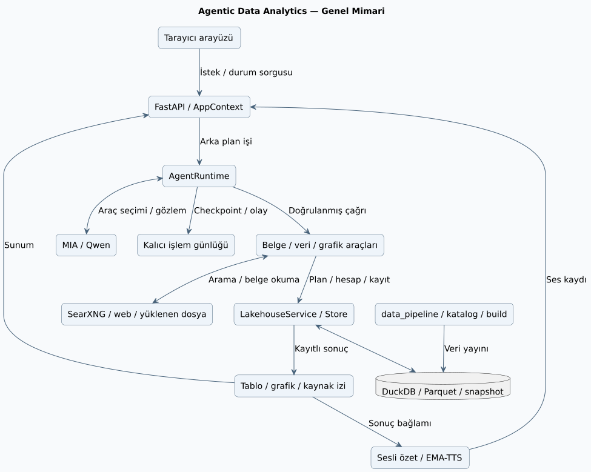
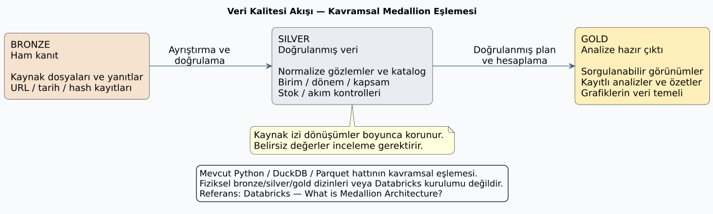
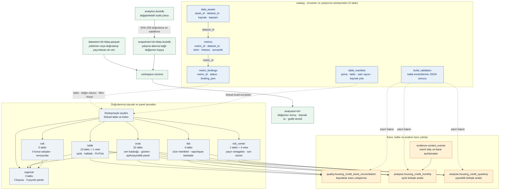
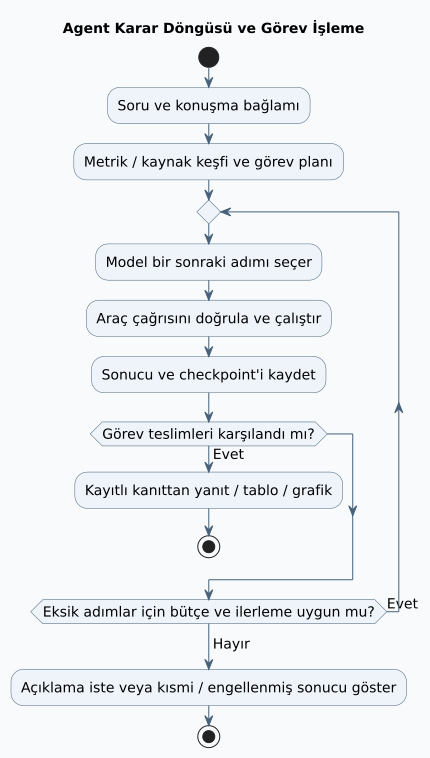

# Agentic Data Analytics

KKB Agentic Data Analytics Hackathon 2026 kapsamında geliştirilen, yerel verileri Türkçe doğal dille incelemek için kaynak izini koruyan bir analiz çalışma alanı. FastAPI tabanlı HTTP API, tarayıcı arayüzü, tek agent döngüsü ve DuckDB lakehouse; soruyu hesap planına, kayıtlı tabloya ve etkileşimli grafiğe dönüştürür.

BDDK, TCMB EVDS, TÜİK ve TBB kaynaklarıyla finans analizi yapılabilir. Boş çalışma alanında kendi dosyalarınız da aynı veri sözleşmeleriyle kullanılabilir.

## Neler yapar?

- Metrik, dönem, birim ve kurum kapsamını keşfeder; büyüme, fark, oran ve uygun parasal serilerde sabit fiyat hesabı yapar.
- Takip sorularıyla önceki analizi sürdürür; değişmeyen sütunları ve önceki analiz kayıtlarını korur.
- Kayıtlı tablonun tamamından çizgi, çubuk, alan, dağılım ve gruplu ısı haritası üretir. Görünüm değişiklikleri veriyi değiştirmez; CSV, PNG ve SVG dışa aktarımı sunar.
- CSV, XLSX, PDF, görsel, HTML ve metin kaynaklarını inceler. Seçilen tablo, açık sütun ve birim sözleşmesiyle hesaplara açılır; görselden çıkarılan hücreler inceleme gerektirir.
- Finansal raporda seçilen kalemleri ve dönemleri kaynak hücrelerinden doğrulayıp içeri alır; modelin elle tarih eşlemesi veya veri sözleşmesi yazmasını gerektirmez. Belirsiz kaynak bilgisi tahminle tamamlanmaz.
- Uzun PDF içinde ilgili sayfayı arar; dönem sütunlarını kaynak hücrelerini koruyarak satırlara çevirir. Statik ve olay kayıtlarını açık grup/takvim sözleşmesiyle analiz eder.
- Dönem toplamlarını ve karşılaştırmaları kayıtlı tablodan hesaplar; sayısal cevabı doğrulanmış sonuçlardan oluşturur. Eksik görev adımlarını tamamlanmış gibi göstermez.
- Kaynak hücresine kadar açıklama, web kaynak araştırması, anomali taraması, değişim tespiti ve ilişki incelemesi sağlar.
- Resmî web kaynağından doğrulanıp workspace dataset'i olarak yayımlanan bir tabloyu, yalnız açık kullanıcı talebiyle içerik adresli ortak lakehouse sürümüne alır. Yeni finans çalışma alanları bu sürümü otomatik görür; mevcut ve generic çalışma alanları değişmez.

## Başlatma

Docker Engine ve Compose ya da Docker Desktop ile, repo kökünden:

```sh
docker compose up --build -d
docker compose ps
```

Logları görerek docker çalıştırmak için:

```sh
docker compose up --build
```

Uygulamaya lokalde http://127.0.0.1:8870 linkinden erişebilirsiniz.

Anahtar, veri hazırlığı ve dolu port için [Docker rehberini](docs/DOCKER.md) izleyin. İmaj finans verisini içermez; Docker kayıtları yerel Python çalışmasından ayrı tutulur.

Repo kökünde Python 3.12 ve `uv` ile:

```sh
uv venv --python python3.12 .venv
source .venv/bin/activate
uv pip install -r requirements-app.lock
```

Temiz klonda finans çalışma alanını kullanmak için yerel veritabanını mevcut kaynaklardan üretin:

```sh
python data_pipeline/lakehouse/build_lakehouse.py
```

Veritabanınız hazırsa veya yalnızca kendi dosyalarınızla boş çalışma alanı kullanacaksanız bu adımı atlayın. Tam EVDS yayınını kullanan mevcut veritabanını temel build ile yeniden üretmeyin; yayın akışı [geliştirme rehberinde](docs/DEVELOPMENT.md#veriyi-hazırlama) açıklanır.

```sh
python -m app --prompt-key --port 8870
```

[Yerel uygulamayı açın](http://127.0.0.1:8870). Anahtar terminalde gizli olarak sorulur; sunucuda `MIA_API_KEY` tanımlıysa mevcut değer kullanılır. Uygulama yerel loopback adresinde çalışır. Kayıtlar varsayılan olarak `.lakehouse-runtime/app/` altında tutulur.

Örnek başlangıç sorusu: “Bankacılık sektörünün 2026 ilk üç aydaki aylık net kârını milyon TL olarak göster.” Sonucu **Tablo**, **Grafik**, **Kaynaklar** ve **Hesap adımları** görünümlerinde inceleyebilirsiniz.

## Modüler kod yapısı

Önemli dosyaların sorumlulukları aşağıdadır; ağaç tüm dosyaları listelemez. HTTP katmanı işleri başlatır, agent araç seçer, veri servisleri hesapları yürütür. Kaynak toplama betikleri uygulamanın çalışma zamanı bağımlılığı değildir; build ve sorgu katmanı ortak metrik/semantik kurallarını paylaşır.

```text
agentic-data-analytics/
├── app/                                # API ve kullanıcı arayüzü
│   ├── server.py                       # FastAPI kurulumu, route ve hata sözleşmeleri
│   ├── context.py                      # Çalışma alanları, arka plan işleri ve runtime kurulumu
│   ├── models.py                       # HTTP isteklerinin doğrulama modelleri
│   ├── routes/                         # Çalışma alanı, analiz ve kaynak endpoint'leri
│   ├── activity.py                     # İşlem günlüğünü kullanıcıya görünen aşamalara dönüştürür
│   └── static/                         # Konuşma, tablo, grafik ve sesli özet arayüzü
├── agentic_analytics/
│   ├── agent/
│   │   ├── runtime.py                  # Karar döngüsü, araç yürütme, bütçe ve hata onarımı
│   │   ├── prompts.py                  # Model talimatları ve görev davranışları
│   │   ├── schemas.py                  # Yapılandırılmış araç/hesap planı sözleşmeleri
│   │   ├── context.py                  # Model için çalışma alanı ve araç bağlamı
│   │   ├── run_store.py                # Konuşma, olay günlüğü ve devam noktaları
│   │   ├── delivery.py                 # Kayıtlı kanıtlardan sonuç metni ve teslim kontrolleri
│   │   └── tools/
│   │       ├── documents.py            # Web/dosya kaynağını alma, inceleme ve tablo okuma
│   │       ├── source_index.py         # Uzun belgede ilgili sayfa ve bölüm keşfi
│   │       ├── document_tables.py      # Tablo yapısı ve kaynak hücre kökeni
│   │       ├── financial_import.py     # Finansal satır/dönem seçimini veri sözleşmesine derler
│   │       ├── datasets.py             # Dış veri için gruplama ve takvim işlemleri
│   │       ├── summary.py              # Kayıtlı analizden dönem özetleri ve karşılaştırmalar
│   │       ├── charts.py               # Kayıtlı analizden grafik görünümü üretir
│   │       └── shared_lakehouse.py     # Açık talep üzerine doğrulanmış ortak veri yayını
│   ├── lakehouse/
│   │   ├── service.py                  # Keşif, plan doğrulama, hesap ve kaynak açıklaması
│   │   ├── store.py                    # Snapshot, dataset ve değişmez analiz kayıtları
│   │   ├── registry.py                 # Ortak metrik tanımları ve bağlamaları
│   │   ├── semantics.py                # Birim, frekans ve stok/akım işlem kuralları
│   │   ├── financial_semantics.py      # Kaynakta belirtilen kümülatif veri işaretleri
│   │   └── shared.py                   # Ortak veri paketleri ve sürüm yönetimi
│   ├── providers/mia.py                # Model sağlayıcısı iletişimi ve sınırlı tekrarlar
│   └── voice/                         # Sonuç bağlamı, ses metni ve yerel EMA-TTS üretimi
├── data_pipeline/                     # Ham kaynaklardan doğrulanmış veri üretimi
│   ├── bddk/                          # BDDK aylık/haftalık/FinTürk dönüşümleri
│   ├── evds/                          # TCMB serileri ve kaynak metadata'sı
│   ├── tuik/                          # TÜİK verileri ve tarihli yayın sürümleri
│   ├── catalog/build_unified_catalog.py # Birleşik kaynak ve metrik kataloğu
│   └── lakehouse/build_lakehouse.py    # DuckDB veritabanı üretimi
├── tools/                             # İndirme, veri toplama ve doğrulama betikleri
├── evals/                             # Canlı deneme, bağımsız puanlama ve benchmark
├── tests/                             # Agent, API, veri işleme ve arayüz testleri
├── notebooks/                         # Veri keşfi ve doğrulama çalışmaları
└── docs/                              # Mimari, kullanım, kaynak ve doğrulama rehberleri
```

Ayrıntılı sorumluluklar ve bağımlılık sınırları: [Mimari rehberi](docs/ARCHITECTURE.md#kodun-sorumlulukları).

## Genel mimari

Uygulama, araç çağrıları yapan tek bir agent döngüsü etrafında kuruludur. Qwen, MIA adaptörü üzerinden hangi aracın hangi parametrelerle çağrılacağını seçer. Plan doğrulama, hesaplama ve kayıt işlemleri Python servislerinde yürütülür. Tarayıcı, API üzerinden iş durumunu ve kalıcı sonuçları okur; grafik ve sesli özet bu sonuçlara bağlıdır.



[PlantUML kaynağı](docs/diagrams/system-architecture.puml) · [Mermaid kaynağı](docs/diagrams/system-architecture.mmd) · [SVG](docs/diagrams/system-architecture.svg) · [Üretim talimatı](docs/diagrams/README.md).

### Bronze / Silver / Gold veri akışı

[Databricks'in Medallion Architecture açıklamasında](https://www.databricks.com/blog/what-is-medallion-architecture) Bronze ham kaynakları, Silver temizlenmiş ve uyumlandırılmış veriyi, Gold ise iş amaçlı kullanıma hazır çıktıları ifade eder. Burada bu adlar mevcut veri hattını açıklayan **kavramsal eşlemedir**; depolama Python, DuckDB ve Parquet ile sağlanır. Repoda fiziksel `bronze/`, `silver/`, `gold/` dizinleri veya Databricks/Delta Lake kurulumu varsayılmaz.



- **Bronze — ham kanıt:** Kaynak paketlerindeki ham yanıtlar/dosyalar ve çalışma alanına alınan belgeler; URL, indirme zamanı ve hash gibi mevcut kaynak kayıtlarıyla korunur. Yeniden işleme özgün kaynaktan yapılabilir.
- **Silver — doğrulanmış veri:** Kaynaklara özgü `processed` çıktıları, normalize gözlemler, metrik kataloğu ve sözleşmesi doğrulanmış dış dataset'ler. Tarih, birim, ölçek, kurum kapsamı ve stok/akım anlamı açıklanır. BDDK kümülatif kâr/zarar verisinden aylık akım yalnız aynı yılın önceki takvim ayı ve uyumlu tanım mevcutsa türetilir; ham değer ayrıca korunur.
- **Gold — analize hazır çıktı:** Sorgulanabilir DuckDB görünümleri/paneller ile çalışma alanında kaydedilen analizler ve özetler. Grafikler bu kayıtlardan üretilir. Veri anlamına uygun toplama yapılır; stoklar zaman boyunca toplanmaz ve eksik gözlemler tahminle doldurulmaz.

DuckDB hem doğrulanmış gözlemleri hem analitik görünümleri barındırabilir; katman ayrımı dosya uzantısına değil sorumluluğa dayanır. Web'den okunan bir belge ortak veriyi otomatik güncellemez; çalışma alanında veri olarak yayımlama ve açık talebe bağlı ortak yayın ayrı adımlardır.

[PlantUML kaynağı](docs/diagrams/medallion-flow.puml) · [Veri üretim sırası](data_pipeline/README.md#üretim-sırası) · [Veri rehberi](docs/DATA.md) · [Ortak yayın akışı](docs/ARCHITECTURE.md#web-verisini-ortak-lakehousea-alma).

### Lakehouse veritabanı yapısı

`data_pipeline/lakehouse/analytics.duckdb`, kaynak Parquet dosyalarının doğrulanmış ve kendi kendine yeterli DuckDB kopyasıdır. Mevcut doğrulanmış build, 10 şemada 72 tablo veya view içerir. Diyagram bütün kolonları değil; katalog sözleşmelerini, kaynak ailelerini ve analitik çıktıların ana veri soyunu gösterir.



`catalog.data_assets → catalog.metrics → catalog.metric_bindings` zinciri, kullanıcının keşfettiği metrik kimliğini fiziksel tablo, değer sütunu, filtreler ve izinli boyutlarla eşler. Bu oklar mantıksal veri sözleşmeleridir; DuckDB içinde foreign key kısıtı olarak tanımlanmış değildir. `catalog.table_manifest` fiziksel build envanterini, `catalog.build_validation` ise yayın kapısının sonucunu tutar.

`analysis` ve `quality` şemaları doğrulanmış kaynakların birleşimidir. Agent doğrudan serbest SQL çalıştırmaz; `metric_bindings` üzerinden çözülen sözleşmeyi doğruladıktan sonra sorgu planını yürütür. Uygulama çalışma zamanında ana veritabanı dosyasını değiştirmek yerine SHA-256 ile doğrulanmış bir snapshot'a bağlanır; kullanıcı dataset'leri ve analiz sonuçları ayrı, içerik adresli nesneler olarak saklanır.

Tam şema açıklaması ve örnek SQL: [Yerel DuckDB lakehouse rehberi](data_pipeline/lakehouse/README.md). Build'in gerçek nesne envanteri `catalog.table_manifest`, kalite sonucu `catalog.build_validation` ve [validation.json](data_pipeline/lakehouse/validation.json) üzerinden doğrulanabilir.

## Doküman işleme yaklaşımı

Belge araçlarını ana agent seçer. CSV, XLSX, PDF, görsel, HTML ve metin dosyaları kaynak olarak kaydedilir; belgeyi okumak ile onu hesaplanabilir dataset olarak yayımlamak ayrı aşamalardır.

1. **Kaynağı bul ve kaydet:** Kullanıcı dosya yükler veya agent web araştırmasıyla belgeyi açar. Arama özeti tek başına sayısal kanıt sayılmaz; ham belge ve kaynak kimliği korunur.
2. **İlgili bölümü oku:** `find_source_pages` uzun PDF içinde sayfa/bölüm bulur; `inspect_source`, `read_source_table` ve `find_source_table_rows` ilgili hücreleri açar. Belgenin tamamı saklanırken modele sınırlı içerik görünümü verilir.
3. **Yapıyı ve anlamı doğrula:** Metin ve tablo çıkarımı kullanılır; OCR veya belirsiz yerleşim inceleme gerektirebilir. Sayfa, tablo, satır/sütun, dönem, para birimi ve kapsam bilgisi kaynak hücreleriyle ilişkilendirilir.
4. **Hesaba aç:** Finansal tablolarda `ingest_source_table`, seçilen satır ve dönemleri deterministik olarak derler. Başlıklar, sayı biçimi, ölçek ve dönem eşlemesi doğrulanınca dataset ve çalıştırılabilir analiz isteği oluşur. Desteklenmeyen düzenlerde kontrollü hazırlama araçları kullanılabilir; belirsiz semantik tahminle tamamlanmaz.
5. **Sonucu üret:** Kayıtlı veri üzerinden analiz/grafik oluşturulur ve kaynak izi gösterilir. Kümülatif veya dönem aralığı belirsiz yeni belgeler özgün değerleriyle gösterilebilir; aylık akıma dönüşüm ya da zaman toplamı için ek kanıt gerekir.

İlgili kod: [documents.py](agentic_analytics/agent/tools/documents.py), [source_index.py](agentic_analytics/agent/tools/source_index.py), [financial_import.py](agentic_analytics/agent/tools/financial_import.py). Ayrıntılar: [mimari ve belge teslimi](docs/ARCHITECTURE.md#tamamlanma-ile-doğruluk), [kaynak dosya kayıtları](docs/SOURCE_IMPORTS.md).

## Agent karar döngüsü ve görev işleme

Her istek çalışma alanı ve konuşma bağlamıyla başlar. Model mevcut metrikleri, kaynakları ve önceki analizi görerek araç çağrısı seçer; çok adımlı görevlerde `plan_task` teslim beklentilerini kaydeder. Runtime araç argümanlarını ve hesap koşullarını doğrular, aracı çalıştırır ve gözlemi modele geri verir. Modelin serbest SQL veya kod yürütme aracı yoktur.



[PlantUML kaynağı](docs/diagrams/agent-decision-flow.puml) · [Mermaid kaynağı](docs/diagrams/agent-decision-flow.mmd) · [SVG](docs/diagrams/agent-decision-flow.svg).

Karar, süre ve onarım bütçeleri sonsuz tekrarları sınırlar. Birim/frekans uyumsuzluğu, kaynak eksikliği veya belirsiz işlem sonucu kaydedilir; uygun hatalarda sınırlı onarım uygulanır. İstek kimliği ve checkpoint'ler kesilmiş işleri sürdürmeyi sağlar. Teknik işlem kayıtları gerçekleşen çağrıları, yöntem notları hesap koşullarını ve kaynak sınırlamalarını görünür kılar.

Teslim katmanı istenen çıktıları denetler; `completed`, `partial`, `blocked`, `needs_input` ve `failed` durumlarını ayırır. Sayısal analiz anlatımı kayıtlı sonuçlara bağlanır. Tamamlanma etiketi tek başına doğru metrik seçimi veya bütün doğal dil yorumlarının doğruluğu anlamına gelmez; bunlar bağımsız eval ile ölçülür.

İlgili kod: [runtime.py](agentic_analytics/agent/runtime.py), [run_store.py](agentic_analytics/agent/run_store.py), [delivery.py](agentic_analytics/agent/delivery.py). Ayrıntılar: [isteğin yürütülmesi](docs/ARCHITECTURE.md#bir-isteğin-yürütülmesi), [geliştirme ve test rehberi](docs/DEVELOPMENT.md).

## Kapsam ve doğrulama

13 Eylül [son doğrulama turunda](docs/research/mentor-improvements-2026-09-12/activity-journey-verification.json) **784 test ve 264 alt test** geçti. İki gerçek Chromium testi çalıştırıldı; süreç özeti ayrıca kaydedilmiş gerçek PDF analizi üzerinde tarayıcıdan incelendi. [Çalışma özeti raporu](docs/research/mentor-improvements-2026-09-12/activity-journey-2026-09-13.md) okunabilir aşamaları ve mobil kontrolleri, [sunum raporu](docs/research/mentor-improvements-2026-09-12/product-presentation-2026-09-13.md) canlı PDF denemesini içerir. [Geliştirme raporu](docs/research/mentor-improvements-2026-09-12/README.md), farklı kaynakları ve önceki canlı denemeleri ayrı ayrı kaydeder. Önceki tarihli doğrulamalar korunur.

Sayısal hesapların doğrulanması, doğal dildeki bütün yorumların doğru olduğunu garanti etmez. Önceki [canlı tutarlılık başlangıç ölçümü](docs/validation/agent-consistency-2026-09-10/README.md), doğru tablo üretimi ile tam görev başarısını ayrı değerlendirir. [Grafik doğrulaması](docs/validation/interactive-charts-2026-09-10/README.md) ise grafik akışını ölçer. Tarihli sonuçlar genel başarı oranı olarak yorumlanmamalıdır.

Arama sonucu kaynak doğrulaması değildir; ilgili belge ayrıca açılmalıdır. Kaynak referanslarının bulunması ile ham dosyaların ayrıca doğrulanması farklı kontrollerdir. Korelasyon, Granger testi ve dağılım grafikleri nedensel etki kanıtı üretmez. Eksik veya anlamı incelenmemiş veriler için uygulanabilecek işlemler sınırlıdır.

Web araştırması ortak lakehouse'u kendiliğinden değiştirmez. Kalıcı paylaşım için kullanıcı açıkça ortak veya ana lakehouse'a ekleme istemeli, kaynak resmî alan adı politikasını ve bütün kaynak/dataset hash kontrollerini geçmelidir. Ayrıntılı akış [mimari rehberinde](docs/ARCHITECTURE.md#web-verisini-ortak-lakehousea-alma) açıklanır.

Kurulum, test ve CLI için [geliştirme rehberi](docs/DEVELOPMENT.md); kodun sorumlulukları için [mimari](docs/ARCHITECTURE.md); kaynak kapsamı için [veri rehberi](docs/DATA.md).

Yerel bileşenlerin lisansları ve SearXNG yapılandırması [açık kaynak rehberinde](docs/OPEN_SOURCE.md) açıklanır.
