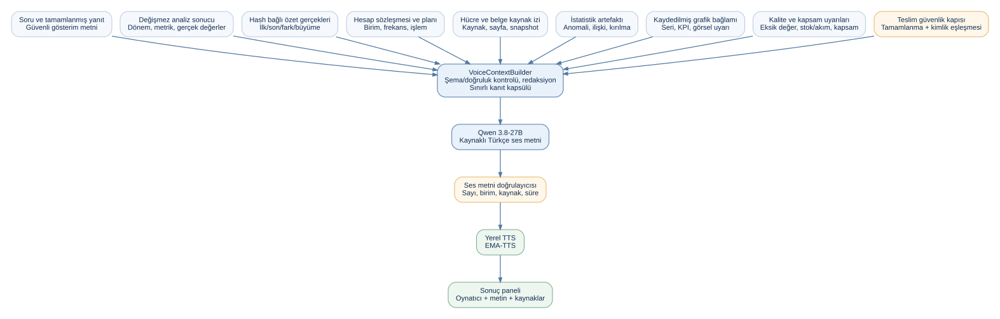

# Yerel Sesli Özet Planı

## Karar özeti

Bu özellik, tamamlanmış ve kaynaklı analiz sonucunu kısa bir Türkçe sesli özete
dönüştürür. Akışta mevcut Kloudeks/Qwen modeli yalnızca **metin özeti** üretir;
ses tanıma ve ses sentezi için hiçbir bulut Voice API kullanılmaz. Ses üretimi
uygulamanın çalıştığı makinede gerçekleşir.

> **Kapsam:** Bu özellik yalnızca yazılı analiz sonucunu yerelde üretilen sese
> dönüştürür. Mikrofon, ses kaydı, ses-metin (STT) ve Whisper kullanılmaz.

## Uygulanacak mimari

Kullanıcının istediği ağaç fikrini koruyoruz: analiz ekranındaki her **uygun
ve doğrulanmış** kanıt kümesi Qwen'e giden bir dal olur, Qwen'den ise tek bir
ses metni çıkar ve tek bir yerel TTS düğümüne gider. Bunun önünde küçük, deterministik bir
`VoiceContextBuilder` bulunur. Bu katman ham SQL, araç argümanları, modelin
iç düşüncesi, API anahtarları ve işlenmemiş/çok büyük tabloların Qwen'e
gitmesini engeller. Böylece "tüm veri" değil, ekranda görünen ve izlenebilir
**kanıt özeti** gönderilir.

Bu gerçek SVG dosyasıdır ve Graphviz ile üretildi. Uygulama PR'ında değişirse
aynı mimari güncellenerek SVG yeniden üretilecektir.

## Mevcut kod tabanından alınacak kanıt kümeleri

Görselde işaretlenen alanların yanı sıra kod tabanındaki veri akışını da
yeniden kontrol ettim. İlk taslaktaki sekiz küme, mevcut kayıtlı artefaktlar
göz önünde bulundurulduğunda aşağıdaki **11** kümeye ayrılır. Bir kümenin
mevcut olması, her seferinde seslendirilmesi gerektiği anlamına gelmez;
`VoiceContextBuilder` yalnız aynı çalışma alanına ve aynı analize bağlı,
bütünlüğü doğrulanmış kayıtları alır.

1. **Soru ve ekranda gösterilen tamamlanmış yanıt:** Kullanıcının sorusu ile
   yalnız tamamlanmış, kaynaklı çalışmanın güvenli gösterim metni.
2. **Değişmez analiz sonucu:** Kaydedilmiş analizin `analysis_id`, şeması,
   dönemleri, satır sayısı ve ses için seçilmiş sınırlı sayıdaki gerçek değer.
   Ham tablo veya bütün satırlar LLM'e gönderilmez.
3. **Hash bağlı özet gerçekleri:** `summarize_analysis` artefaktındaki ilk,
   son, en düşük/en yüksek, fark veya büyüme gibi gerçekler; her biri kaynak
   analiz, dönem, birim ve ölçekle birlikte taşınır.
4. **Hesap sözleşmesi ve planı:** Seçili metrikler, tarih aralığı, frekans,
   birim anlamı ve `growth`/`difference`/`deflate` gibi uygulanmış işlemlerin
   insan okunur özeti.
5. **Hücre düzeyi kaynak izi:** Metrik, kaynak sistemi, birim, ölçek, dönem,
   `snapshot_id`, veri özeti ve gerektiğinde satır/hücre açıklama kaydı.
6. **Doğrulanmış belge/veri kümesi alıntısı:** Kullanıcının eklediği PDF,
   CSV veya URL kaynağından yalnız seçilip analize yayımlanmış tablo hücreleri,
   belge adı, sayfası ve içerik özeti. İncelenmiş ama seçilmemiş tablolar
   anlatılmaz.
7. **İstatistik artefaktları:** Anomali, korelasyon, Granger ve kırılma
   sonuçları. Yalnız `analysis_id` ve veri özeti eşleşen artefaktlar alınır;
   nedensellik ancak ilgili kayıt bunu destekliyorsa söylenir.
8. **Kaydedilmiş grafik bağlamı:** Grafik türü, başlık, seçili seri, KPI,
   görsel uyarılar ve grafiğe bağlı kaynak etiketleri. Grafik yeni değer
   üretmez; sayılar 2. veya 3. kümeden gelir.
9. **Veri kalitesi ve kapsam uyarıları:** Eksik gözlem, farklı birim/ölçek,
   stok-akım ayrımı, sıralama sınırı ve konsolide grup–sektör gibi kapsam
   farkları. Varsa bunlar zorunlu sesli uyarıdır.
10. **Çalışma tamamlanma ve teslim kaydı:** Çalışmanın `completed` durumu,
    hata/engellenme bilgisi ve teslimin hangi analize bağlı olduğu. Bu bir
    anlatı kaynağı değil, ses üretiminin güvenlik kapısıdır.
11. **Doğrulanmış kaynak kapsamı:** Kaynağın yayıncı, belge/sayfa veya resmi
    URL kimliği; yalnız kaynak izinde zaten onaylı olan etiketler kısa biçimde
    seslendirilebilir.

### Bilerek dışarıda bırakılanlar

- Takip sorusu önerileri (`followup_context`): Bunlar modelin sonraki
  inceleme için sıraladığı seçeneklerdir; yeni finansal kanıt değildir.
- Kayıtlı kaynakların yalnız gezinme metadatası: Analize seçilip yayımlanmış
  hücreye bağlanmadıkça sayı veya iddia olarak kullanılmaz.
- Agent aktivite günlüğü: Yalnız tamamlanma/hata kapısı için kullanılır;
  araç argümanı, SQL, ham araç çıktısı, model iç düşüncesi ve kurtarma ayrıntısı
  ses metnine girmez.
- `research_web` ile tamamlanan ya da açık soru/hata içeren çalıştırmalar:
  güvenli gösterim yeniden üretilmediği için ilk sürümde seslendirilmez.

## Ses metni sözleşmesi

`VoiceContextBuilder` yukarıdaki kayıtlı nesnelerden sürümlü bir
`VoiceBriefInput` üretir. Zorunlu bağlar `workspace_id`, `run_id`,
`analysis_id`, `data_sha256` ve uygun olduğunda `snapshot_id`dir. İçerik;
soru, güvenli yanıt özeti, sınırlı kanıt gerçekleri, dönem aralığı,
metrik/birim, plan, kaynak kapsülleri, istatistik kanıtı, grafik bağlamı ve
uyarıları içerir. Değer yoksa alan boş kalır; sıfır, ortalama veya türetilmiş
değer uydurulmaz.

Derleyici, özet/istatistik/grafik/belge kaydının aynı `analysis_id` ve veri
özetine bağlı olduğunu doğrular. Eski bir grafik, başka çalışma alanının
artefaktı veya yalnız kaynak listesinde duran bir belge reddedilir. Çalışma
tamamlanmamış, engellenmiş ya da doğrulanabilir analiz sonucu yoksa Qwen ve
TTS hiç çağrılmaz.

Qwen'e verilecek talimat şunları zorunlu kılar:

- 45 saniyeyi aşmayan, doğal Türkçe bir özet yaz.
- Yalnız `VoiceBriefInput` içindeki sayıları, birimleri ve kaynakları kullan.
- Nedensellik, kesinlik veya trend iddiası ekleme.
- Eksik değer, farklı birim veya sınırlı kapsam uyarısını sesli söyle.
- Başlık, Markdown, kod, URL ve "kaynakça" listesi yazma; seslendirmeye
  uygun düz metin üret.

Qwen çıktısı tekrar doğrulanır: sayı/birim eşleşmesi, izinli kaynaklar ve
azami karakter/süre sınırı kontrol edilir. Geçmezse ses dosyası üretilmez;
UI, yazılı analiz sonucunu koruyup kısa hata mesajı gösterir.

Sağ sonuç alanındaki mevcut dört panelin yanına beşinci bir **Sesli Özet**
paneli eklenir. Kullanıcı bu paneli açtığında, doğrulanmış Qwen ses metni ve
oynatılabilir yerel ses dosyası görünür. İlk sürümde indirme yerine oynatma
sunulur; kartta "Bu ses yerelde üretildi" etiketi ve TTS'nin aldığı kesin
metin transkripti yer alır.

Oynatma sırasında, ses dosyasının gerçek genlik örneklerinden beslenen bir
waveform animasyonu gösterilir. Animasyon yalnız görsel geri bildirimdir:
ses verisini değiştirmez, konuşma tanıma yapmaz ve `prefers-reduced-motion`
tercihinde sabit/az hareketli duruma geçer. Oynat/durdur, süre ve hata durumu
klavye ile erişilebilir kalır. İlk yüklemede waveform önceden hesaplanmış
hafif tepe değerleriyle çizilir; tarayıcıda büyük ses dosyasını tekrar
çözümlemek zorunda bırakılmaz.

İlk görsel referans, [OpenAI Realtime Blocks — Minimal](https://openai-realtime-blocks.vercel.app/components/minimal-component)
bileşeninin ince, satır içi waveform yaklaşımıdır. Bu referanstan yalnız
oynatmaya bağlı çizgi animasyonu alınır; React, Tailwind, WebRTC, mikrofon ve
canlı oturum kodu alınmaz. Renderer, mevcut açık zemin/lacivert/turuncu KKB
tasarım tokenlarıyla vanilla CSS ve JavaScript olarak yazılır. Görsel sonuç
uygun bulunmazsa `VoiceBriefInput`, Qwen, EMA-TTS veya API sözleşmesini
değiştirmeden yalnız waveform renderer ve CSS değiştirilebilir.

## Model seçimi - Türkçe için sıralama

Bir modeli "en iyi" ilan etmek için kendi finansal terimlerimizle yerel bir
dinleme ve doğruluk testi gerekir. Bu nedenle sıralama, lisans + Türkçe
desteği + çalıştırma maliyeti + ürün olgunluğuna göre başlangıç sıralamasıdır.

| Sıra | İş | Aday | Neden | Karar |
| --- | --- | --- | --- | --- |
| 1 | TTS | [EMA-TTS](https://huggingface.co/canberkkkkkk/ema-tts) | 65M parametreli Türkçe model; yerelde 48 kHz WAV üretir ve model kartı Apache-2.0 lisanslıdır. | İlk sesli yanıt sürümünün yerel TTS'si. Model paketi ve AudioVAE ağırlığı önceden indirilir; istek anında ağ kullanmaz. |
| 2 | TTS | [FreyaTTS-small](https://huggingface.co/freyavoice/Freya-TTS) | Türkçe, Apache-2.0 ve self-host edilebilir alternatif. | EMA-TTS dinleme değerlendirmesi yetersiz kalırsa ikinci aday. |
| 3 | TTS | [Piper Türkçe DFKI](https://huggingface.co/rhasspy/piper-voices/tree/main/tr/tr_TR/dfki/medium) | Küçük CPU seçeneği. | Varsayılan değil: mevcut Türkçe DFKI ses veri lisansı CC BY-NC-SA 4.0 olduğundan ürün kapsamı için ayrıca hukuk onayı gerekir. |

EMA-TTS için model paketi ve codec ağırlığı sabit sürümle bir volume'a
sağlanacaktır. Demo öncesi finansal terimler ve sayılarla mutlaka dinleme testi
yapılacaktır. Kaynaklar: [EMA-TTS model kartı](https://huggingface.co/canberkkkkkk/ema-tts),
[FreyaTTS-small](https://huggingface.co/freyavoice/Freya-TTS),
[Piper Türkçe DFKI model kartı](https://huggingface.co/rhasspy/piper-voices/blob/main/tr/tr_TR/dfki/medium/MODEL_CARD).

`gTTS` ve `edge-tts` bu tasarımda kullanılmayacaktır: açık kaynak Python
paketi olsalar da ses üretimini Google/Microsoft servislerine yaptırırlar;
yarışmadaki "haricî bulut Voice API yasak" koşulunu karşılamazlar.

## Aşamalı uygulama planı

1. **Sözleşme ve güvenlik:** `VoiceBriefInput`, redaksiyon, sayısal doğrulama,
   süre sınırı ve ses artefakt yaşam döngüsünü ekle. Yalnız tamamlanmış,
   kaynaklı analizler seslendirilebilir.
2. **Yerel TTS POC:** EMA-TTS ile tek bir arka plan işçisi kur. Model
   ağırlıkları imaj/volume için sabit sürümle sağlanır;
   istek sırasında haricî ses servisine ağ çağrısı yapılamaz.
3. **Qwen özetleme:** Yeni, dar bir ses-özet promptu ve çıktı doğrulayıcısını
   ekle. Qwen başarısızsa ham uzun analizi seslendirmek yerine kullanıcıya
   güvenli hata göster.
4. **UI ve erişilebilirlik:** Sonuç panelindeki Sesli özet kartı, `audio`
   kontrolü, metin transkripti, yükleniyor/hata durumları ve klavye erişimini
   ekle. Aynı analiz tekrar açıldığında kayıtlı metin/artefakt doğrulanır.

Yerel çalıştırmada `docker compose up` önce `voice-provision` init servisini
çalıştırır; bu servis `VOICE_EMA_MODEL` dizininde model ve codec yoksa bir kez
indirir, varsa manifest ve dosyaları doğrulayıp hemen çıkar. Böylece `down -v`
ile volume silinse bile sonraki `up` ses modeli hazır olmadan uygulamayı
başlatmaz. Bu dizin,
EMA-TTS kaynak kodunu, `ckpt/model.safetensors`, `ckpt/config.json` ve ilk
kurulumda önceden indirilmiş AudioVAE cache'ini içerir. Model yoksa servis
güvenli biçimde hata verir; uygulama model indirmez ve çalışma anında dış ağa
çıkmaz.

## Önerilen dosya planı ve commit sırası

Sesle ilgili backend işleri, mevcut agent ve HTTP katmanlarını gereksizce
büyütmemek için ayrı bir `agentic_analytics/voice/` paketi altında tutulur.
İlk üç backend adımı bu pakette uygulanır. Backend HTTP rotası yalnız
doğrulama/artefakt erişimi için eklenebilir; arayüz aşağıdaki geçiş kapısı
geçilene kadar eklenmez.

> **Geçiş kapısı:** İlk üç backend commit'i tamamlanıp testleri geçtiğinde;
> doğrulanmış `VoiceBriefInput` → Qwen ses metni → yerel EMA-TTS ses artefaktı
> akışı bir örnek analizle çalıştırılır. Sonuç kullanıcıya gösterilir ve
> **kullanıcıdan onay/yanıt alınmadan frontend commit'ine geçilmez**. Backend
> başarısızsa önce aynı katmanda düzeltilir; UI için geçici veya mock ses verisi
> üretilmez.

| Commit | Dosyalar | Sorumluluk |
| --- | --- | --- |
| `Add verified voice brief contract` | `agentic_analytics/voice/__init__.py`, `agentic_analytics/voice/context.py`, `tests/voice/test_context.py` | `VoiceBriefInput` şeması; analiz, özet, istatistik, grafik ve kaynak artefaktlarının kimlik/bütünlük kontrolü; redaksiyon ve kanıt sınırı. |
| `Generate and validate Turkish voice scripts` | `agentic_analytics/voice/script.py`, `tests/voice/test_script.py` | Dar Qwen promptu, en fazla 45 saniyelik metin, sayı–birim–kaynak doğrulaması; geçersiz çıktı reddi. |
| `Add local EMA-TTS speech artifacts` | `agentic_analytics/voice/ema.py`, `agentic_analytics/voice/service.py`, `tests/voice/test_tts.py` | Sabit sürümlü EMA-TTS işlemi, yerel ses dosyası yaşam döngüsü, çalışma alanı/analiz erişim sınırı ve ağsız çalışma testi. |
| `Expose voice summary API and UI` | `app/routes/voice.py`, `app/main.py` veya mevcut route kaydı, `app/static/app.js`, `app/static/app.css`, `app/static/index.html`, ilgili `tests/app/` dosyaları | Oluşturma/durum/oynatma uçları; sağ sonuç alanındaki beşinci Sesli Özet paneli, transkript, erişilebilir hata/yükleme durumu ve Minimal referanslı, gerçek ses genliğiyle eşleşen waveform. |
| `Test end-to-end voice safety` | ses ve app testleri | Farklı artefakt kimliği, eksik/kapsam uyarısı, Qwen/TTS hatası, yetkisiz çalışma alanı erişimi ve dış ağ çağrısı yapılmaması. |

`context.py` yalnız kanıt kapsülünü kurar; `script.py` yeni hesap yapmaz;
`ema.py` yalnız doğrulanmış metni yerelde ses dosyasına dönüştürür. Route ve UI
katmanı bu üç sorumluluğu birbirine karıştırmaz. Waveform, ses artefaktına ait
sınırlı görsel tepe verisiyle çalışır; ham ses analizi veya ses girişi yapmaz.
Model ağırlıkları Python paketi içine konmaz; Docker volume veya sabit imaj
katmanında sürüm ve lisans bilgisiyle yönetilir.

## Başarı ve test ölçütleri

- Sabit bir analiz fikstüründe üretilen ses metnindeki her sayı, birim ve
  kaynak `VoiceBriefInput` ile eşleşir; ek sayı bulunmaz.
- Aynı görünümlü fakat farklı `analysis_id`/`data_sha256` taşıyan özet,
  istatistik, grafik veya belge kaydının derleyici tarafından reddedildiği
  test edilir.
- Eksik gözlem, kapsam farkı ve stok-akım uyarısı varsa ses metninde korunduğu;
  takip önerisi, ham aktivite olayı ve yalnız gezinme kaynağının ise
  seslendirilmediği test edilir.
- Türkçe finans terimleri ("mevduat", "çeyrek", "yüzde puan", "milyar TL")
  için EMA-TTS dinleme kaydı yapılır; telaffuz sorunları kayıt altına alınır.
- TTS isteği sırasında ağ çıkışı yapılmadığı entegrasyon testinde doğrulanır.
- Ses dosyası, çalışma alanı ve analiz kimliğiyle bağlanır; başka çalışma
  alanından okunamaz.
- Qwen/TTS başarısız olduğunda tablo, grafik, kaynak ve yazılı cevap bozulmaz.
- Oynatma durumu waveform ile eşleşir; duraklatma, bitiş ve `prefers-reduced-motion`
  durumları için arayüz testi yapılır.

## Kapsam dışı

İlk sürümde kişiye ait sesi klonlama, mikrofon/ses kaydı, ses-metin, gerçek
zamanlı iki yönlü konuşma, haricî Voice API, ses dosyasını kalıcı olarak
herkese açık paylaşma ve modelin ses metninde yeni analiz yapması yoktur.

### Açık ürün kararı: mikrofonla giriş

Mikrofonla prompt girişi bu sesli özet özelliğinin ön koşulu değildir ve ilk
sürüme dahil edilmez. Sonradan eklenmesine karar verilirse, ayrı bir STT
özelliği olarak değerlendirilir: yerel model, açık rıza, kayıt saklama politikası,
tarayıcı izin akışı ve yarışma kurallarına uygunluk için yeni güvenlik tasarımı
ve ayrı bir plan/PR gerekir. Bu karar, mevcut TTS panelini veya sesli özet
veri sözleşmesini değiştirmez.
