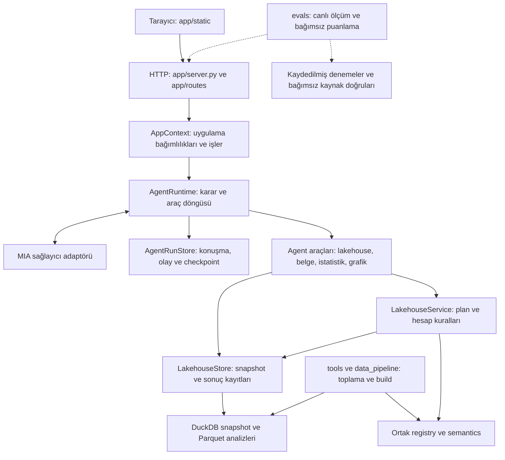

# Mimari

Uygulama, doğal dilde verilen bir isteği kontrollü araç çağrılarına dönüştürür. Model metrik ve işlem seçer; sayısal hesaplar deterministik servislerde yürütülür. HTTP katmanı, agent ve veri toplama kodu ayrı sorumluluklara sahiptir.

## Katmanlar ve akış

Grafik, istatistik ve belge araçları ihtiyaçlarına göre kayıt deposunu kullanır. Her araç sayısal plan çalıştırmaz. Örneğin grafik görünümü, mevcut analiz değerlerinden oluşturulur; tabloyu yeniden hesaplamaz.

## Kodun sorumlulukları

| Konum | Sorumluluk |
| --- | --- |
| [app/server.py](../app/server.py) | `create_app` ile uygulamayı kurar; middleware, hata sözleşmeleri ve route gruplarını bağlar |
| [app/context.py](../app/context.py) | Snapshot seçimi, çalışma alanı bağımlılıkları, arka plan iş havuzu ve runtime oluşturma |
| [app/models.py](../app/models.py), [app/routes/](../app/routes/) | HTTP istek modelleri ve endpoint grupları |
| [app/static/](../app/static/) | Konuşma, tablo, grafik, kaynak inceleme ve hesap adımları arayüzü |
| [agent/runtime.py](../agentic_analytics/agent/runtime.py) | Tek karar döngüsü, araç dispatch, bütçeler, hata işleme ve kesintiden devam |
| [agent/run_store.py](../agentic_analytics/agent/run_store.py) | Konuşmalar, işler, olaylar, araç niyetleri ve checkpoint kayıtları |
| [agent/prompts.py](../agentic_analytics/agent/prompts.py), [schemas.py](../agentic_analytics/agent/schemas.py) | Agent talimatı ve modele sunulan yapılandırılmış istek sözleşmeleri |
| [agent/context.py](../agentic_analytics/agent/context.py) | Çalışma alanından model için bağlam ve sınırlı araç görünümü oluşturma |
| [agent/delivery.py](../agentic_analytics/agent/delivery.py) | Açık grafik isteğini tanıma ve kayıtlı grafik tercihinden onay mesajı oluşturma |
| [agent/tools/](../agentic_analytics/agent/tools/) | Lakehouse araç kaydı, belge alımı, deterministik istatistik ve grafik görünümü |
| [lakehouse/service.py](../agentic_analytics/lakehouse/service.py) | Keşif, plan doğrulama, hesap, revizyon ve kaynak hücresi açıklaması |
| [lakehouse/store.py](../agentic_analytics/lakehouse/store.py) | Değişmez snapshot/dataset/analysis dosyaları, hash kontrolü ve çalışma alanı sürümleri |
| [lakehouse/analysis.py](../agentic_analytics/lakehouse/analysis.py) | Sabit etkileri artıklaştıran deterministik analiz yardımcısı |
| [lakehouse/registry.py](../agentic_analytics/lakehouse/registry.py), [semantics.py](../agentic_analytics/lakehouse/semantics.py) | Build ile sorgu katmanının paylaştığı metrik sözleşmeleri, birim, frekans ve kaynak kapsamı politikaları |
| [lakehouse/quality.py](../agentic_analytics/lakehouse/quality.py), [cli.py](../agentic_analytics/lakehouse/cli.py) | Veritabanı kalite kontrolleri ve modelsiz komut satırı kullanımı |
| [providers/mia.py](../agentic_analytics/providers/mia.py) | Sağlayıcı HTTP iletişimi, yanıt doğrulama ve sınırlı tekrar denemeleri |
| [data_pipeline/](../data_pipeline/), [tools/](../tools/) | Resmî kaynak indirme, normalize etme, katalog/build, toplama kuyruğu ve yayın |
| [evals/](../evals/) | Canlı uygulama denemesi, bağımsız puanlama ve performans ölçümü |

## Bağımlılık sınırları

`app` uygulama bağımlılıklarını bir araya getirir; ekonomik hesap kurallarını route içinde tanımlamaz. Agent, lakehouse ve sağlayıcı paketlerini kullanır. Lakehouse modülleri HTTP uygulamasına veya agent karar döngüsüne bağımlı değildir.

Çalışan uygulama kaynak toplama betiklerini içe aktarmaz. Veri üreticileri ile uygulama, ortak kayıt ve semantik kuralları `agentic_analytics/lakehouse/registry.py` ve `semantics.py` üzerinden paylaşır. Kaynak görünümü üretimi gibi build işleri `data_pipeline/lakehouse/` içinde kalır. `evals` ve `tests`, üretim katmanlarının bağımlılığı değildir.

Modelin araç arayüzü serbest SQL, dosya sistemi yolu veya çalıştırılabilir Python/JavaScript kabul etmez. Bu sınır, geliştiriciye açık deterministik SQL/CLI kullanımından ayrıdır. Sağlayıcı kimlik bilgileri sunucu yapılandırmasında tutulur.

## Bir isteğin yürütülmesi

1. Kullanıcı bir çalışma alanına mesaj gönderir. HTTP katmanı istek kimliğiyle bir arka plan işi oluşturur.
2. Runtime, konuşmayı ve çalışma alanının aktif analiz/grafik bağlamını yükler. Uygun metrikler keşfedilir; model yapılandırılmış araç çağrıları üretir.
3. Araç şeması ve gerekiyorsa hesap planı doğrulanır. Birim, frekans, stok/akım, kurum grubu ve kaynak hazır oluşu işlemden önce kontrol edilir.
4. Araç niyeti ve sonucu kalıcı olarak kaydedilir. Hesaplar yeni analiz kaydı üretir; revizyon önceki kaydın üzerine yazmaz.
5. Grafik istenirse kayıtlı analizden ayrı bir görünüm kaydedilir. Yalnız görünüm değişikliğinde veri sürümü ve tablo hücreleri korunur.
6. API durum ve olayları tarayıcıya sunar. Kullanıcı tabloyu, grafiği ve kaynak açıklamasını inceleyebilir; kesilmiş bir işin kayıtlı kimliği üzerinden devam edilebilir.

İstek kimliğiyle tekrar gönderim aynı işe döner. Bu, bağımsız bir model denemesi değildir. Araç düzeyinde de kaydedilmiş niyet, sonuç ve tekrar kullanım bilgisi tutulur; belirsiz bir yazma işlemi körlemesine tekrarlanmaz.

## Veri ve kayıt modeli

| Kayıt | Davranış |
| --- | --- |
| Kaynak ham dosyası | Orijinal değer ve kaynak hashleri korunur; türetme ayrı alanlarda açıklanır |
| Snapshot | Çalışma alanı belirli bir doğrulanmış veritabanı sürümüne bağlanır |
| Dataset | Kullanıcının seçtiği dış tablo, açık veri sözleşmesiyle yayımlanır |
| Analysis | Tam sonuç tablosu, plan, şema ve kaynak zinciri birlikte saklanır |
| Çalışma alanı | Aktif analiz ve veri sürümü ilerler; önceki analizler korunur |
| Grafik / istatistik kaydı | İlgili analiz kimliğine ve değerlerine bağlı ayrı çıktı olarak saklanır |
| Run / olay günlüğü | Model kararları, araç çağrıları, hatalar, kullanım ve checkpoint bilgisi tutulur |

Varsayılan uygulama kayıt kökü `.lakehouse-runtime/app/` dizinidir. Büyük ham veri yayınları ve çalışma kayıtları Git'e taşınmaz. Dosya yolları ve veri kapsamı için [veri rehberine](DATA.md), ayrı kayıt diziniyle çalıştırma için [geliştirme rehberine](DEVELOPMENT.md) bakın.

Yeni bir veri yayını yeni çalışma alanlarında kullanılabilir; mevcut çalışma alanlarının snapshot'ı sessizce değiştirilmez. Kaynak bağlantıları bulunan bir hücre, ayrıca ham dosyadan doğrulanmış sayılmaz: açıklama API'sindeki kaynak referansı tamlığı ve dosya doğrulaması alanları farklı anlam taşır.

## Tamamlanma ile doğruluk

İşin `finished` olması, runtime'ın bir sonuç döndürdüğünü gösterir. Sonuç `completed`, `partial`, `blocked`, `needs_input` veya `failed` olabilir. `completed` etiketi tek başına sayısal ya da anlamsal doğruluk kanıtı değildir.

Grafik teslimi `chart_updated`, veri değişikliği `analysis_updated` ile ayrı izlenir. Açık grafik isteği için bu turda ilgili analize bağlı grafik kaydı gerekir. Yalnız grafik görünümünü değiştiren isteğin onayı kayıtlı tariften oluşturulur. Yeni hesap ve yorum isteyen genel analizlerin metin sentezi modelde kalır; bu alandaki yanlış yorumlar [tutarlılık başlangıç ölçümünde](validation/agent-consistency-2026-09-10/README.md) kaydedilmiştir.

`evals/consistency.py` gerçek uygulamaya bağımsız denemeler gönderir; doğruluk puanı vermez. `evals/grading.py`, kaydedilmiş tam çıktıları bağımsız kaynak doğrularıyla karşılaştırır ve son metin için cevabın hashine bağlı ayrı inceleme bekler. [Tarihli raporlar](README.md#tarihli-araştırma-ve-doğrulama-kayıtları) bu ayrımlarla okunmalıdır.
