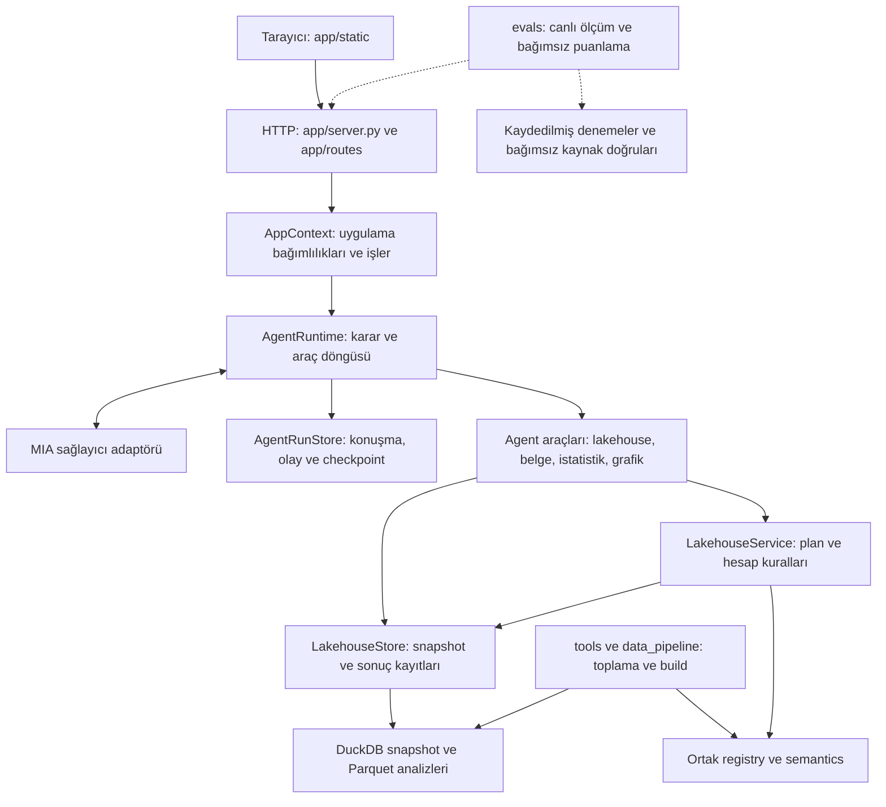

# Mimari

Uygulama, doğal dilde verilen bir isteği kontrollü araç çağrılarına dönüştürür. Model metrik ve işlem seçer; sayısal hesaplar deterministik servislerde yürütülür. HTTP katmanı, agent ve veri toplama kodu ayrı sorumluluklara sahiptir.

## Katmanlar ve akış

Grafik, istatistik ve belge araçları ihtiyaçlarına göre kayıt deposunu kullanır. Her araç sayısal plan çalıştırmaz. Örneğin grafik görünümü, mevcut analiz değerlerinden oluşturulur; tabloyu yeniden hesaplamaz.

## Kodun sorumlulukları

| Konum | Sorumluluk |
| --- | --- |
| [app/server.py](../app/server.py) | `create_app` ile uygulamayı kurar; middleware, hata sözleşmeleri ve route gruplarını bağlar |
| [app/context.py](../app/context.py) | Snapshot seçimi, çalışma alanı bağımlılıkları, arka plan iş havuzu ve runtime oluşturma |
| [app/models.py](../app/models.py), [app/routes/](../app/routes/) | HTTP istek modelleri ve endpoint grupları |
| [app/static/](../app/static/) | Konuşma, tablo, grafik, kaynak inceleme ve hesap adımları arayüzü |
| [agent/runtime.py](../agentic_analytics/agent/runtime.py) | Tek karar döngüsü, araç dispatch, bütçeler, hata işleme ve kesintiden devam |
| [agent/run_store.py](../agentic_analytics/agent/run_store.py) | Konuşmalar, işler, olaylar, araç niyetleri ve checkpoint kayıtları |
| [agent/prompts.py](../agentic_analytics/agent/prompts.py), [schemas.py](../agentic_analytics/agent/schemas.py) | Agent talimatı ve modele sunulan yapılandırılmış istek sözleşmeleri |
| [agent/context.py](../agentic_analytics/agent/context.py) | Çalışma alanından model için bağlam ve sınırlı araç görünümü oluşturma |
| [agent/delivery.py](../agentic_analytics/agent/delivery.py) | Tablo/grafik teslim koşulları; değişmez analiz, özet ve istatistik kayıtlarından sayısal cevap üretme |
| [agent/tools/](../agentic_analytics/agent/tools/) | Lakehouse araç kaydı, belge alımı, deterministik istatistik ve grafik görünümü |
| [agent/tools/financial_import.py](../agentic_analytics/agent/tools/financial_import.py) | Finansal tablo için iş düzeyindeki satır/dönem seçimini kaynak kanıtlı yayımlama sözleşmesine ve doğrudan çalıştırılabilir analiz isteğine dönüştürme |
| [agent/tools/summary.py](../agentic_analytics/agent/tools/summary.py), [datasets.py](../agentic_analytics/agent/tools/datasets.py) | Kayıtlı analizde dönem toplamı/karşılaştırma; statik ve olay verisinde açık gruplama, takvim ve toplama |
| [agent/tools/source_index.py](../agentic_analytics/agent/tools/source_index.py), [document_tables.py](../agentic_analytics/agent/tools/document_tables.py) | Uzun PDF'de kaynak sayfası bulma; birleşik HTML başlıkları ve hücre kökeni |
| [lakehouse/discovery.py](../agentic_analytics/lakehouse/discovery.py), [financial_semantics.py](../agentic_analytics/lakehouse/financial_semantics.py) | Uzun istekten metrik araması, açıklanabilir aday anlamı, birikimli veri ve fiyat esası kontrolleri |
| [lakehouse/service.py](../agentic_analytics/lakehouse/service.py) | Keşif, plan doğrulama, hesap, revizyon ve kaynak hücresi açıklaması |
| [lakehouse/store.py](../agentic_analytics/lakehouse/store.py) | Değişmez snapshot/dataset/analysis dosyaları, hash kontrolü ve çalışma alanı sürümleri |
| [lakehouse/analysis.py](../agentic_analytics/lakehouse/analysis.py) | Sabit etkileri artıklaştıran deterministik analiz yardımcısı |
| [lakehouse/registry.py](../agentic_analytics/lakehouse/registry.py), [semantics.py](../agentic_analytics/lakehouse/semantics.py) | Build ile sorgu katmanının paylaştığı metrik sözleşmeleri, birim, frekans ve kaynak kapsamı politikaları |
| [lakehouse/quality.py](../agentic_analytics/lakehouse/quality.py), [cli.py](../agentic_analytics/lakehouse/cli.py) | Veritabanı kalite kontrolleri ve modelsiz komut satırı kullanımı |
| [providers/mia.py](../agentic_analytics/providers/mia.py) | Sağlayıcı HTTP iletişimi, yanıt doğrulama ve sınırlı tekrar denemeleri |
| [data_pipeline/](../data_pipeline/), [tools/](../tools/) | Resmî kaynak indirme, normalize etme, katalog/build, toplama kuyruğu ve yayın |
| [evals/](../evals/) | Canlı uygulama denemesi, bağımsız puanlama ve performans ölçümü |

## Bağımlılık sınırları

`app` uygulama bağımlılıklarını bir araya getirir; ekonomik hesap kurallarını route içinde tanımlamaz. Agent, lakehouse ve sağlayıcı paketlerini kullanır. Lakehouse modülleri HTTP uygulamasına veya agent karar döngüsüne bağımlı değildir.

Çalışan uygulama kaynak toplama betiklerini içe aktarmaz. Veri üreticileri ile uygulama, ortak kayıt ve semantik kuralları `agentic_analytics/lakehouse/registry.py` ve `semantics.py` üzerinden paylaşır. Kaynak görünümü üretimi gibi build işleri `data_pipeline/lakehouse/` içinde kalır. `evals` ve `tests`, üretim katmanlarının bağımlılığı değildir.

Modelin araç arayüzü serbest SQL, dosya sistemi yolu veya çalıştırılabilir Python/JavaScript kabul etmez. Bu sınır, geliştiriciye açık deterministik SQL/CLI kullanımından ayrıdır. Sağlayıcı kimlik bilgileri sunucu yapılandırmasında tutulur.

## Bir isteğin yürütülmesi

1. Kullanıcı bir çalışma alanına mesaj gönderir. HTTP katmanı istek kimliğiyle bir arka plan işi oluşturur.
2. Runtime, konuşmayı ve çalışma alanının aktif analiz/grafik bağlamını yükler. Uygun metrikler keşfedilir; model yapılandırılmış araç çağrıları üretir.
3. Araç şeması ve gerekiyorsa hesap planı doğrulanır. Birim, frekans, stok/akım, kurum grubu ve kaynak hazır oluşu işlemden önce kontrol edilir.
4. Araç niyeti ve sonucu kalıcı olarak kaydedilir. Hesaplar yeni analiz kaydı üretir; revizyon önceki kaydın üzerine yazmaz.
5. Grafik istenirse kayıtlı analizden ayrı bir görünüm kaydedilir. Yalnız görünüm değişikliğinde veri sürümü ve tablo hücreleri korunur.
6. API durum ve olayları tarayıcıya sunar. Kullanıcı tabloyu, grafiği ve kaynak açıklamasını inceleyebilir; kesilmiş bir işin kayıtlı kimliği üzerinden devam edilebilir.

İstek kimliğiyle tekrar gönderim aynı işe döner. Bu, bağımsız bir model denemesi değildir. Araç düzeyinde de kaydedilmiş niyet, sonuç ve tekrar kullanım bilgisi tutulur; belirsiz bir yazma işlemi körlemesine tekrarlanmaz.

## Veri ve kayıt modeli

| Kayıt | Davranış |
| --- | --- |
| Kaynak ham dosyası | Orijinal değer ve kaynak hashleri korunur; türetme ayrı alanlarda açıklanır |
| Snapshot | Çalışma alanı belirli bir doğrulanmış veritabanı sürümüne bağlanır |
| Dataset | Kullanıcının seçtiği dış tablo, açık veri sözleşmesiyle yayımlanır |
| Analysis | Tam sonuç tablosu, plan, şema ve kaynak zinciri birlikte saklanır |
| Çalışma alanı | Aktif analiz ve veri sürümü ilerler; önceki analizler korunur |
| Grafik / istatistik kaydı | İlgili analiz kimliğine ve değerlerine bağlı ayrı çıktı olarak saklanır |
| Hesap özeti | Dönem penceresi, kullanılan sütunlar, grup, hesap ve eksik veri koşullarıyla hash üzerinden doğrulanan ayrı JSON kaydı |
| Run / olay günlüğü | Model kararları, araç çağrıları, hatalar, kullanım ve checkpoint bilgisi tutulur |

Varsayılan uygulama kayıt kökü `.lakehouse-runtime/app/` dizinidir. Büyük ham veri yayınları ve çalışma kayıtları Git'e taşınmaz. Dosya yolları ve veri kapsamı için [veri rehberine](DATA.md), ayrı kayıt diziniyle çalıştırma için [geliştirme rehberine](DEVELOPMENT.md) bakın.

Yeni bir veri yayını yeni çalışma alanlarında kullanılabilir; mevcut çalışma alanlarının snapshot'ı sessizce değiştirilmez. Kaynak bağlantıları bulunan bir hücre, ayrıca ham dosyadan doğrulanmış sayılmaz: açıklama API'sindeki kaynak referansı tamlığı ve dosya doğrulaması alanları farklı anlam taşır.

## Tamamlanma ile doğruluk

İşin `finished` olması, runtime'ın bir sonuç döndürdüğünü gösterir. Sonuç `completed`, `partial`, `blocked`, `needs_input` veya `failed` olabilir. `completed` etiketi tek başına sayısal ya da anlamsal doğruluk kanıtı değildir.

Grafik teslimi `chart_updated`, veri değişikliği `analysis_updated` ile ayrı izlenir. Açık grafik isteği için bu turda ilgili analize bağlı grafik kaydı gerekir. `plan_task`, çok adımlı isteğin teslimlerini ve bilinen hesap koşullarını kaydeder. Eksik adımlar, araştırma veya soru sorma çıkışından başarı diye geçirilemez. Belgeyi okumak, onu sorgulanabilir veri olarak yayımlamak ve istenen hesabı üretmek farklı kanıtlardır.

Sayısal analiz cevabı kayıtlı ve hash'i doğrulanmış tablo/özet/istatistikten deterministik olarak oluşturulur. Modelin yazdığı hesaplanmamış sayılar bu cevabın yerine geçmez. Bu önlem yanlış metrik seçimini veya kaynak metninin her türlü yorumunu tek başına doğrulamaz. Önceki [tutarlılık başlangıç ölçümü](validation/agent-consistency-2026-09-10/README.md), bu değişikliklerden önceki davranışı kaydeder.

Yeni belgede `find_source_pages` ile ilgili PDF sayfaları bulunur; `inspect_source` ve `read_source_table` özgün hücreleri gösterir. Ana yol `ingest_source_table` aracıdır: model ilgili kalemleri, dönemleri ve gerekirse TOTAL gibi kaynak başlığını seçer. Deterministik derleyici kaynak hücrelerinden tarihleri, birimi, ölçeği ve sayı biçimini çözerek yayımlama sözleşmesini oluşturur. Başarılı sonuç doğrudan çalıştırılabilir `analysis_request` içerir. Modelden tarih eşlemesi, veri tipi veya kayıt anahtarı tarif etmesi beklenmez.

`prepare_source_table` ve `combine_source_tables` sayıları yeniden yazmadan yapısal dönüştürme yapan alt katmandır. Derleyicinin açıkça desteklenmeyen bir düzen bildirmesi ileri düzey yayımlama yoluna izin verir; anlamsal belirsizlik veya inceleme gereksinimi bu yoldan aşılmaz. OCR ile çıkarılan veya yerleşimi belirsiz hücreler inceleme bekler. Uzun belgenin tamamı kalıcı kaynakta bulunur, modele sınırlı gezinti görünümü verilir.

`aggregate_dataset` içindeki `source_value` işlemi, çıktı anahtarı başına tam bir kaynak kaydını olduğu gibi analize alır. Dönemleri birleştirmez veya yeniden etiketlemez; birden fazla kaydı ilk/son seçimiyle gizleyemez. Birikimli akım ve anlamı belirsiz veri özgün değerleriyle gösterilebilir; inceleme durumu ve zaman boyunca toplama yasağı korunur. Kaynak değerini göstermek ile hesap yapmak ayrı izinlerdir. Böylece bir ara dönem raporunu tablo ve grafikte göstermek için aylık akım varsayımı gerekmez.

Yeni belgenin hazır durumdaki stokları, mevcut takvim serileriyle `execute` içinde açık `alignment="period_end"` seçimiyle karşılaştırılabilir. Kaynak frekansı `event` olarak kalır; seçilen penceredeki her olay tarihi hedef takvimin tam son gününe eşleşmelidir. Dönem sonuna uymayan tarih varsa bütün plan reddedilir, gözlem sessizce atılmaz veya taşınmaz. Eksik aylar null kalır. Özgün tarih ve hücre izi korunur. Bu işlem akımlarda, inceleme gerektiren veride veya düzenli takvim serilerini yeniden etiketlemek için kullanılamaz. Kaynaklar arası oranlar ayrıca mevcut birim, fiyat temeli ve açık kapsam karşılaştırması kontrollerinden geçer.

Yayımlanmış verinin `available_series` kataloğu tam metrik ve boyut seçimlerini gerçek kayıt dosyasından verir. Agent runtime, derleyici mevcutken ileri düzey hazırlama/yayımlama araçlarını ancak ilgili kaynak ve tablo için açık `unsupported_layout` sonucuyla açar. Bu izin çağrı yürütülürken de doğrulanır, yalnız kanıtlı hazırlanmış alt tablolara taşınır ve yeni turda sıfırlanır. İnceleme reddi ileri düzey yola geçiş izni sayılmaz. Normal CSV'nin yedek yolu ve doğrudan belge API'si korunur.

Normal takvimli dış seriler katalog üzerinden diğer verilerle aynı `execute` akışına girer. Statik/olay verisi `aggregate_dataset` ile açık gruplama ve dönemleme kullanır. Hesaplar eksik dönemleri sıfır yapmaz, stokları zaman boyunca toplamaz, birikimli akımı ayrı dönem akımı saymaz. Gruplu grafik ve revizyonlar önceki kaynak hücrelerini korur.

`evals/consistency.py` gerçek uygulamaya bağımsız denemeler gönderir; doğruluk puanı vermez. `evals/grading.py`, kaydedilmiş tam çıktıları bağımsız kaynak doğrularıyla karşılaştırır ve son metin için cevabın hashine bağlı ayrı inceleme bekler. [Tarihli raporlar](README.md#tarihli-araştırma-ve-doğrulama-kayıtları) bu ayrımlarla okunmalıdır.
