# KKB Hackathon: veriye uygun analitik platform ve teslim planı

**10 Eylül 2026 | İncelenen uygulama: `dc757c29` | Araştırma ve plan, uygulanmış özellik listesi değildir.**

**Canlı servis güncellemesi, 01:08:** Kloudeks üzerinde 20 küçük istekle native araç döngüsü, yapılandırılmış JSON ve 4096 boyutlu embedding gözlendi. OCR yatay bir tabloda başarısız olurken aynı hücreler kare tuvalde doğru okundu. Ayrıntı ve sınırlar [canlı yetenek raporunda](../mia-probe-2026-09-10/README.md). Bu, uçtan uca lakehouse agent'ının tamamlandığı anlamına gelmez.

En güçlü yön, mevcut veri temelini tamamlayıp onun üzerinde **yeni soruya ve yeni veriye uyabilen, yaptığı hesabı kanıtlayabilen bir analiz çalışma alanı** kurmaktır. Bunun için önce hesap sözleşmelerindeki açıklar kapanmalı; metrik ve boyut keşfi güçlenmeli; ardından Kloudeks ile çalışan, sonuçlarını kalıcı tutan tek bir agent döngüsü ve yarışmanın altı araç ailesi tamamlanmalıdır. Depolama teknolojisini baştan değiştirmek veya geniş bir skill platformu kurmak, mevcut kritik açıkları çözmez.

Yarışma bir analitik motor, veri hazırlama ve güvenilir çok adımlı çalışma bekliyor. Kod ajanlarından alınacak fikirler bu sonuca hizmet etmelidir: küçük ve ilgili bağlam, açık araç sözleşmeleri, çalışma durumu, kontrollü hata düzeltme ve kalıcı sonuçlar. Resmi sayısal jüri ağırlıkları yayımlanmış kaynaklarda yoktur; aşağıdaki öncelikler teknik değerlendirmedir, birincilik garantisi veya resmi puan tablosu değildir.[^1]

## 1. Yarışmanın sınayacağı iş

| Gereklilik | Kaynak | Üründe gösterilecek davranış |
| --- | --- | --- |
| Soruyu anla, planla, hesapla, doğrula, kaynakla ve sun | PDF s.7 | Cevaptaki sayı gerçek araç sonucundan gelir; tablo/grafik/rapor üretilebilir. |
| BDDK haftalık, aylık, FinTürk ve EVDS tüm serileri; Ocak 2021-Haziran 2026 | PDF s.8-9 | 66 aylık hedef aralığı ve her kaynağın doğal frekansı korunur; katalog ve gözlem kapsamı ayrı raporlanır. |
| Altı asgari araç ailesi | PDF s.10; kayıt 15:45-16:04 | Lakehouse, web arama, URL okuma, anomali, nedensellik incelemesi, değişim tespiti çalışır. |
| Aynı konuşmada analizi geliştir | PDF s.11; kayıt 17:04-17:40 | Yalnız istenen sütun değişir; yeni endeks eklenirken eski hücreler korunur. |
| Demo sırasında yeni URL ve veri | PDF s.13,26; kayıt 17:43-18:22 | Görülmemiş PDF, Excel, görsel veya metin mevcut analize alınır. |
| Finans yerine sağlık verisiyle aynı motor | Kayıt 12:33-12:55 | Genel kayıt, kalite ve sorgu çekirdeği alan profiline göre çalışır. |
| Güçlü harness, modele az iş | Kayıt 28:38-29:09 | Model seçim yapar; zaman, birim, hesap ve yayın kontrolleri kodla uygulanır. |
| Python, açık kaynak bileşenler, Kloudeks model erişimi | PDF s.18,20,28 | Geliştirme ve demo boyunca çözümün LLM çağrıları Kloudeks'ten geçer; uyum gerçek servisle ölçülür. |
| Çalışan, incelenebilir ve yeniden kurulabilir teslim | PDF s.24,26; kayıt 23:09-24:17 | Teslim commit'i ve veri manifestiyle başka ortamda aynı araç sonuçları üretilebilir. |

Bu maddeler, [tam yarışma denetiminde](competition-audit.md) ve [makinece okunabilir gereklilik kaydında](requirements.json) ayrıntılı kaynak konumlarıyla bulunur. Sunumun 31 sayfası ve kaydın tam otomatik dökümü incelendi. Döküm atıfları sesin her saniyesinin bu araştırmada yeniden dinlendiği anlamına gelmez. Grafik içeren 12. sayfa görsel olarak da kontrol edildi. Konut grafiği örnek çıktıdır, sabit sayısal cevap anahtarı değildir.[^1]

Çevrimiçi geliştirme 7-20 Eylül, finalist duyurusu 5 Ekim, final 17 Ekim olarak açıklanıyor. Resmi etkinlik sayfası çevrimiçi bitişi ve final tarihini doğruluyor. Kayıt 22:55-23:09 ve 25:46-26:07, dondurma sonrası güncelleme yapılmamasını ve demonun dondurulan commit ile aynı olmasını açıkça istiyor. Bilinmeyen kesin dondurma saatidir; yeni resmi duyuru aksini söylemedikçe bu kural geçerli kabul edilerek teslim 20 Eylül'e göre planlanmalı. Yerel bilgisayarda demo, kayıt 24:46-25:11'de açıkça mümkün sayılıyor.[^1][^2]

## 2. Bugünkü temelin gerçek durumu

Mevcut kaynaklar, doğal frekansta anlamlandırılmış veriler, doğrulanan yayınlar ve değişmez analiz sonuçları kullanılabilir bir temel oluşturuyor. Önceki 223 test ve 20 gerçek veri/CLI kabul kontrolü, altyapının belirli sözleşmelerini doğruluyor. Bu araştırmada ayrıca **30 temsilî servis çağrısı**, kaynak SQL karşılaştırmaları ve finanssız küçük bir veri tabanı deneyi yapıldı. Kaynak DuckDB dosyasının SHA-256 değeri değişmedi. Bunlar canlı Qwen veya tüm olası soru başarısı değildir.[^3]

| Envanter | Mevcut durum | Yorumu |
| --- | --- | --- |
| Metrik sözleşmeleri | 55.501 | 2.824 hazır; 564 inceleme istiyor; 52.099 yalnız metadata; 14 sayısal değer içermiyor. |
| EVDS | 52.696 metadata serisi; 599 fiziksel seri; hedefte 587 sayısal seri | “Tüm serilerin gözlemleri tamamlandı” denemez. Katalog kapsamı ile indirilen veri aynı şey değil. |
| BDDK aylık | 17 tablo, 66 ay, 10 grup; 1.334.850 semantik ölçüm | Kümülatif değer ile aylık akım ayrımı mevcut. |
| BDDK haftalık | 9 tablo, 286 hafta, 7 grup; 1.025.974 ölçüm | Ham seçim çalışıyor; geniş dönüşüm kullanımı hâlâ inceleme kısıtı taşıyor. |
| FinTürk | 7 tablo, 22 çeyrek; 936.512 ölçüm | İl/banka grubu, kaynak null'ı ve türetilmiş değer ayrımı önemli. |
| TBB ve Risk Merkezi | Ek normalize kaynaklar mevcut | Ana BDDK/EVDS kapsamını ikame etmez. Yayın gecikmesi ve kurum tanımı ayrıca korunur. |
| Analiz deposu | Snapshot, sürüm, parent analiz, kaynak referansları | Aynı tablonun hedefli revizyonu için değerli mevcut yatırım. |
| Doğal dil ve yeni belge akışı | Canlı Qwen döngüsü ve genel URL alımı tamamlanmamış | Araç altyapısı ile uçtan uca ürün ayrı olgunluk düzeyinde. |

Sayıların ayrıntılı tanımları mevcut yayın kaydı ve bağımsız denetimde yer alır. Ölçüm, metrik ve kaynak serisi adetleri birbirine bölünerek genel başarı yüzdesi üretilmemelidir.[^3]

### Önce kapatılması gereken açıklar

| Öncelik ve soru | Ölçülen davranış | Gereken düzeltme |
| --- | --- | --- |
| P0: “2026 ilk çeyrek net kârı?” | Doğru üç aylık toplam **288.688 milyon TL**. `last` seçilince yalnız Mart akımı **119.287 milyon TL**, uyarısız `ok` dönüyor. | Çeyrek toplamı ile son ay akımının anlamı ayrılmalı; yanlış etiketli sonuç yayımlanmamalı. |
| P0: “Kârı reel göster” | Sanayi üretim endeksi deflatör olarak kabul edilebiliyor. | Fiyat deflatörü rolü ve amaç denetlenmeli; herhangi bir endeks enflasyon değildir. |
| P1: “İstanbul altın mevduatı” | Arama 0 sonuç; gerçek veri doğrudan kimlikle okunabiliyor. | Metrik ile şehir/boyut çözümlemesi ayrılmalı. |
| P1: “Altın mevduatında ilk 10 il” | Sorgu dili boyutları tek skaler değere sabitliyor; genel gruplama/sıralama yok. | Filtre, `group_by`, `order_by`, `top_k`, sayfalama ve grain kontrolü eklenmeli. |
| P1: “Kişi başı kredi kaç TL arttı?” | Hem büyüme hem mutlak fark engelleniyor. | Yüzde oranı ile TL/kişi türü ayrılmalı; fark doğru birimde hesaplanmalı. |
| P1: “Haftalık ticari kredi büyümesi” | Ham seri var; dönüşüm semantik inceleme nedeniyle kapalı. | Doğrulanmış aileler tek tek açılmalı; tanım kırılmaları korunmalı. |
| P1: “Ayın son yayımlanan altın fiyatı” | Son fiziksel satır null ise daha önceki gerçek fiyat kendiliğinden seçilmiyor. | Son satır, son sayısal gözlem ve tarihli `as_of` ayrı olmalı; kullanılan gözlem tarihi görünmeli. |
| P1: “Finansı çıkarıp sağlık verisi koy” | Finans üstüne açık sözleşmeli klinik CSV ekleniyor. Finanssız veri tabanı, mevcut finans kalite/registry bağımlılığına takılıyor. | Genel yayın/kayıt çekirdeği ile finans kaynak profili ayrılmalı. |

Tam istekler, yanıtlar, kod konumları ve kabul şartları [bağımsız sistem denetiminde](current-system-audit.md); ham deney kaydı [JSON dosyasında](current-system-audit.json). Bu açıklar araştırma sırasında düzeltilmedi. İlk iki bulgu, güçlü bir modelden önce güçlü bir yürütme denetimi gerektiğini doğrudan gösteriyor.[^3]

## 3. Bu veri için lakehouse kararı

**Parquet kaynakları + DuckDB sorgulama + değişmez snapshot/analiz yaklaşımı korunsun.** Bir sonraki yatırım veri anlamı, edinme kapsamı ve agent'ın kullanabildiği işlemlerdir. Bu denetimde tablo formatı değişimini zorunlu kılan bir performans ölçümü veya çoklu yazıcı gereksinimi bulunmadı.

Bronze kaynak baytlarını, istek parametrelerini, indirme zamanını ve hash'i korur. Silver doğal frekans, ölçü birimi, ölçek, kapsam, dönem, eksiklik nedeni ve kaynak locator'ı taşır. Gold tekrar kullanılabilir iş ölçülerini ve analiz tablolarını içerir. Belirli bir kullanıcı analizinin planı, sonuç sürümü ve soy ağacı ayrıca analiz deposunda tutulur. Tek bir önceden hazırlanmış konut paneli, diğer soruların zorunlu başlangıcı olmamalıdır.

Bugünkü yapı yerel bir lakehouse ve sorgu/yayın düzenidir; DuckDB dosyasının kendisi bağımsız bir açık lakehouse tablo formatı diye sunulmamalı. DuckDB'nin yerel süreç içi kullanımındaki yazıcı sınırları, bu ürünün tek kontrollü yayıncı yaklaşımıyla uyumludur. Güncel belgelerde alternatif uzak yazma yolları da bulunduğundan “DuckDB hiçbir koşulda çoklu süreç yazamaz” genellemesi doğru değildir.[^4]

DuckLake; snapshot, transaction ve katalog düzeyinde sürüm yönetimi sunan gerçek bir sonraki adaydır. Ancak tam veri kopyalama maliyeti, artımlı yayın sıklığı, bağımsız yazıcı veya çoklu motor ihtiyacı ölçülünce değerlendirilmelidir. Şimdi göç etmek, yanlış deflatörü veya il sıralama eksiğini çözmez.[^5]

### Veri sözleşmesini güçlendirme

Tek bir `kind` alanı para, oran, stok, akım ve kişi başı ölçünün bütün davranışını taşımaya zorlanmamalı. Önerilen sözleşme ayrı eksenler içerir:

- **Birim ve ölçek:** TL, milyon TL, kişi, TL/kişi, yüzde, endeks; gerektiğinde pay/payda birimleri.
- **Zaman anlamı:** stok, dönem akımı, yıl içi kümülatif, başlangıçtan birikim; doğal frekans ve izinli dönüşümler.
- **İstatistik anlamı:** tutar, sayı, fiyat, oran, yoğunluk veya endeks rolü; deflasyon gibi özel işlemin amacı.
- **Kapsam ve anahtarlar:** kaynak namespace'i, kurum evreni, coğrafya, kategori, gözlem grain'i ve join kardinalitesi.
- **Kalite ve sürüm:** eksiklik nedeni, tanım kırılması, yayın/revizyon bilgisi, ham kaynak locator'ı, hesap izni.

Bu öneri hem finans hem sağlık için gereklidir. Ziyaret/kişi yoğunluğu, kredi/müşteri tutarı ve yüzde oranı farklı birim cebiri ister. Tüm bölmelere izin vermek kadar hepsini aynı birim şartına bağlamak da yanlış kapsam üretir. Grup toplamlarında örtüşen banka grupları, kişi sayılarında tekilleştirme, coğrafi hiyerarşide yurtdışı ayrıca denetlenmelidir.

### EVDS kapsamı ayrı kritik yol

Mevcut kalıcı toplama kuyruğu yeniden başlatılabilir iş, lease ve ham kaynak izi sağlıyor. İndirilen yanıtın sorgulanabilir metrik olarak yayına alınması ayrıca tamamlanmalıdır. İş durumu şu ayrımları görünür tutmalı: katalogda kayıtlı, hedef döneme uygunluğu değerlendirildi, indirme denendi, gözlem döndü, sayısal veri bulundu, semantik doğrulandı, snapshot'a yayımlandı.

İlk gün kuyruk üretiminin aynı seriyi gereksiz frekanslarda çoğaltıp çoğaltmadığı incelenmeli. Önce kaynak frekansı ve mevcut ham yanıtlar kullanılmalı; küçük, sınırlı bir partiyle gerçek hız ve hata profili ölçülmeli. Kalan iş / ölçülen hız hesabı yeniden denemelerle birlikte teslim tahminini verir. Gözlemi olmayan veya hedef dönem dışında kalan seriler gerekçeleriyle ayrılır. Servis kotası bilinmeden bitiş süresi veya tamamlanmış kapsam sözü verilmez. “Tüm seriler” şartı, yalnız önemli görülen birkaç yüz seriyi seçerek kapatılmış sayılamaz.[^1][^3]

## 4. Önerilen çalışma mimarisi

*Şema hedef yapıyı gösterir. Kesikli kutular yeni veya genişletilecek davranışlardır. Düz çizgili snapshot ve sonuç deposu mevcut temeldir; uçtan uca akış henüz tamamlanmış değildir.*

İlk sürümde tek karar verici Qwen, açık bir Python durum makinesi ve tipli araç sözleşmeleri yeterli başlangıçtır. Akışın kalıcı durumu küçük bir işlem kaydı/checkpoint deposunda tutulur. Veri tablosu bu kaydın içine kopyalanmaz; snapshot ve analiz kimlikleri taşınır. Kısa bir kesinti/yeniden başlatma deneyi, el yapımı döngüde karmaşık bakım doğurursa aynı düğümler LangGraph'a taşınabilir. İki tam framework uygulaması geliştirmek bu takvimde öncelik değildir.[^6]

1. **İsteği ve önceki analizi yükle.** Yeni hesap, revizyon, kaynak açıklaması ve yeni veri ihtiyacını ayır.
2. **Adayları bul.** Metrik kartı, kaynak kapsamı ve boyut değerlerini getir; gerçek belirsizlik varsa tek hedefli açıklama iste.
3. **Yapısal plan çıkar.** Kaynak/metrik, dönem, filtre, gruplama, birleştirme, dönüşüm ve istenen çıktı biçimini açıkça yaz.
4. **Zorunlu kontrolü uygula.** Birim, zaman, kapsam, eksiklik, join ve kaynak politikası doğrulanmadan hiçbir hesap/yayın çalışmasın.
5. **Aracı çalıştır.** Sayılar Python/DuckDB'de hesaplansın; istatistik ve belge araçları aynı sonuç sözleşmesini kullansın.
6. **Sonucu denetle ve kaydet.** Tablo şeması, kaynak izi, kalite uyarıları ve korunacak hücreler karşılaştırılsın.
7. **Sun.** Model, kayıtlı sonuçtan kısa açıklama üretsin; tablo ve grafik doğrudan sonuç dosyasından çizilsin.

Üç ayrı durum vardır: sohbet ne istendiğini; run kaydı işin hangi aşamada olduğunu; değişmez analiz nesnesi hangi veriyle hangi hesabın yapıldığını tutar. Sohbet özeti finansal değerin otoritesi değildir. `run_id + step_id + plan_hash + input_revision` gibi bir işlem kimliği, yanıt kaybolduğunda daha önce tamamlanan işi bulmak için kullanılmalıdır. Checkpoint tek başına dış yan etkinin yalnız bir kez gerçekleşmesini sağlamaz.[^6]

Başlangıç sınırı olarak bir turda en fazla 8 model kararı, 2 plan düzeltmesi ve 3 farklı keşif sorgusu önerilir. Bunlar ölçülmüş servis sınırı veya yarışma kuralı değildir. 401/403 erişim engelinde durulur; geçici 429/5xx bütçeli denenir; aynı hata/argüman döngüsü ilerleme yok diye sonlandırılır. Veri eksikliği benzer seri uydurularak aşılmaz. Araç sonucuna bağlanmayan sayısal başarı iddiası üretilmez.

## 5. Claude, Codex ve benzer projelerden alınacaklar

| Kaynak | Doğrulanmış örüntü | Yarışmadaki karşılığı |
| --- | --- | --- |
| Claude Agent SDK | Agent döngüsü, oturum sürdürme, hooks, bağlam yönetimi ve sınırlanabilir alt görevler | Uzun PDF veya çok turlu analizde kaldığı yerden devam; araç öncesinde daima çalışan kendi doğrulayıcımız.[^7] |
| Codex | Thread/turn/item olayları, konuşma devamı, çalışma çıktıları; skill talimatını ihtiyaç halinde yükleme | Konuşma, çalışma ve analiz durumunu ayırma; küçük metrik kartları; görünür revizyon izi.[^8] |
| WrenAI | Semantik proje tanımı, ilgili bağlam seçimi, planlama/doğrulama/yürütme ayrımı | Türkçe soruyu önce doğru metrik, kaynak ve boyutlara bağlama.[^9] |
| Vanna | Konuşma depolama, araç yaşam döngüsü ve tablo/grafik/özet akışı | Gerçek araç olaylarından beslenen çalışma ekranı.[^10] |
| DB-GPT | Plan, bellek, eylem ve kaynak bileşenlerini ayırma | Veritabanı ve sonradan gelen dosyanın ortak araç sözleşmesi.[^11] |
| Spider 2.0 ve DABstep | Şema ve iş kuralı bağlamıyla birden fazla adımdan oluşan analizi değerlendirme | Çalışan kodla yetinmeyen, doğru kaynak ve nihai sonucu ölçen kabul seti.[^12] |

Claude SDK'da konuşma çatallamak dosya sistemini izole etmez; dosya checkpoint'i de rastgele shell veya özel veri tabanı işlemini geri alma garantisi değildir. Aynı şekilde araç otomatik onay listesi, bütün güven denetiminin yerine konamaz. Bu nedenle veri yayını ve analiz revizyonunun kontrolü kendi servisimizde kalmalıdır.[^7]

Güncel Codex SDK belgeleri Python ve TypeScript yolları içerir; bunlar Codex runtime'ını kontrol eder. Claude SDK belgeleri de kendi desteklenen sağlayıcı yollarını anlatır. İkisinden herhangi birinin yarışmanın MIA alias'ıyla doğrudan uyumlu olduğu bu araştırmada gösterilmedi. Buradaki öneri bu SDK'ların ürün runtime'ını taşımak değil, ölçülebilir çalışma örüntülerini Kloudeks üstünde uygulamaktır.[^7][^8]

İlk teslim için tek analizi yazan tek koordinatör önerilir. Bağımsız belge indirmeleri normal Python görevleriyle paralelleşebilir. Çok-agent ancak aynı bütçe ve aynı testlerle ölçülen avantaj sağlarsa eklenir. Skill altyapısı sonraya bırakılır; bugün alan sözlükleri ve yöntem kuralları çekirdekten ayrı dosya/sözleşmelerde tutulur. Yeni veri geldiğinde alan profili önerilebilir, fakat modelin ürettiği kural testten geçmeden aktif hesap kuralı olmaz.

Detaylar: [Claude/Qwen ve harness araştırması](harness-research.md), [Codex eşlemesi](codex-patterns.md), [benzer analitik sistemler](similar-systems.md). Ürün özellikleri resmi belgelerden incelendi; bu projeler Kloudeks üzerinde kurulup benchmark edilmedi.

## 6. Sağlanan modellerin somut görevleri

| MIA modeli | Görevi | İlk doğrulama |
| --- | --- | --- |
| `kkbhackathon2026/Qwen3.8-27B` | İstek çözümleme, aday seçimi, plan, araç seçimi, sınırlı düzeltme, kaynaklı anlatım | Native tool call ve ikinci tur, JSON şeması, Türkçe seçim, gerçek yanıt alanları ve gecikme |
| `kkbhackathon2026/Qwen3-Embedding-8B` | Metrik sözlüğü ve yöntem notlarında aday arama | Gerçek vektör boyutu, batch davranışı, Türkçe retrieval başarısı |
| `kkbhackathon2026/Unlimited-OCR` | Taranmış veya yerleşimi gerekli belge görsellerini çözme | Sayı/birim/hücre doğruluğu, kaynak sayfa konumu, zor örneklerde hata |

Model kimlikleri paylaşılan MIA rehberinden aynen alınmalıdır. Qwen3.8 adı başka bir kamuya açık Qwen modelinin bağlam sınırı veya araç desteğiyle eşitlenemez. Rehber sohbet örneği verir; native function calling, strict JSON, streaming veya sınırsız kota garantisi vermez. Qwen/vLLM belgelerindeki özellikler de sunucu ayrıştırıcısı ve sürümüne bağlıdır.[^13][^14]

Python ile sonraki canlı doğrulamada 20 küçük sentetik istek çalıştırıldı. Native `tool_calls`, ikinci turda araç sonucunu kullanma ve incelenen JSON şemaları başarılıydı. İlk adaptör bu yollara dayanabilir; yerel semantik doğrulama korunur. Özellikle adlandırılmış araç seçiminde `tool_calls` doluyken `finish_reason=stop` gözlendi. HTTP 200 tek başına çıkarım başarısı değildir: iki OCR isteği bu durum koduyla hatalı çıktı verdi. [Canlı yetenek raporu](../mia-probe-2026-09-10/README.md), gözlenen süreleri ve kapsamı kaydeder; gerçek lakehouse soru başarısı henüz ölçülmedi.

Arama önce kimlik/kod, kaynak filtresi, Türkçe eş anlamlılar ve boyut değerleriyle çalışmalı. Embedding bu aday havuzunu zenginleştirir. Ölçülen mevcut katalog açılımı yaklaşık 43,4 milyon karakterken beş altın metrik kartı 2.507 karakterdir. Bunlar token ölçümü değildir; bütün kataloğu bağlama taşımamak için somut gerekçedir. Doğru ama gözlemi henüz yok metrik aramadan gizlenmemelidir.[^3]

## 7. Altı araç ailesini tamamlamak

| Aile | İlk teslimin gerçek işlevi | Kabul şartı |
| --- | --- | --- |
| Lakehouse | Boyut keşfi; filtre/grup/sıralama; güvenli join; takvim/birim dönüşümü; kayıtlı revizyon | Görülmemiş il, oran, kişi başı ve kümülatif soru doğru hesaplanır veya gerekçeli durur. |
| Web arama | Analizin gerektirdiği dış belge/bağlamı bul; gerçek sayfayı oku | Arama özeti nihai kanıt sayılmaz; iddia ilgili kaynak içeriğine bağlanır. |
| URL okuma | PDF, Excel, HTML/metin ve görseli indir; tablo adaylarını çıkar; doğrula ve çalışma alanına ekle | URL/sayfa/hücre, birim ve tarih korunur; yeni kaynak aktif veriyi sessizce ezmez. |
| Anomali | Uygun seride geçmişe dayalı robust skor ve gerektiğinde mevsimsel yaklaşım | Parametre, kullanılan gözlemler, skorlanamayan dönemler ve veri eksikliği görünür. |
| Nedensellik incelemesi | Korelasyon, gecikmeli ilişki ve uygun koşullarda Granger/varsayımlı etki incelemesi | Yöntem uygunluğu ve nedensel iddianın destek düzeyi açık; yetersiz veri için hesap uydurulmaz. |
| Değişim tespiti | Seviye/trend kırılmasına yönelik bölümleme, örneğin PELT | Tek noktalı aykırılık ile kalıcı değişim ayrılır; ceza ve minimum parça uzunluğu kaydedilir. |

Notebook'taki gecikmeli korelasyon, sabit etkili keşif ve rolling-MAD yararlı başlangıçlardır. Ancak bunlar genel agent araçları olarak paketlenmiş değildir; `lakehouse_analysis.py` yalnız bir sabit etki artıklaştırma yardımcısı içerir. Notebook hücresini ürün aracı saymadan seri seçimi, eksiklik, örneklem, yöntem ve sonuç sözleşmesi genellenmelidir.[^3]

Zaman serilerinde düzey trendi, durağanlık, mevsimsellik, gecikme sayısı ve çoklu deneme yanlış ilişki izlenimi üretebilir. Granger aracı gecikmeli öngörü katkısını sınar; ekonomik nedenselliği tek başına ispatlamaz ve kullanılan statsmodels işlevi eksik değer kabul etmez. Etki tahmini gerekiyorsa tanımlama varsayımı ve çürütme/duyarlılık kontrolleri ayrı sunulmalıdır. Yarışma metni nedenselliği incelemeye yardımcı araç ister; her soruya kesin neden üretmek gerekmez.[^1][^15][^16]

PELT gibi değişim tespiti yöntemi seçildiğinde frekansa uygun minimum segment ve ceza etkisi görünür olmalı. Aylık 66 veya çeyreklik 22 gözlemde sınırsız gecikme/parametre taraması yapılmamalı. Gerçek veya sentetik bilinen sıçrama/kırılma örnekleriyle davranış doğrulanmalıdır.[^17]

### Yeni URL'nin lakehouse'a girişi

Yerel metin/tablo ayrıştırması PDF/Excel/HTML için ilk yol olmalı. Mevcut pypdf, Pandas ve HTML araçları yeniden kullanılabilir. Docling'in model kullanmayan native PDF yolu da zor yerleşimlerde değerlendirilebilir; ek VLM açılması yarışmanın model erişim şartından bağımsız düşünülmemeli.[^18]

Taranmış sayfalar MIA OCR'a base64 görsel olarak gönderilir. Rehberde OCR için bir istekte en fazla 3, sohbet/görsel modelinde 5 görsel belirtilir; bunlar toplam belge sayfa sınırı değildir. OCR'ın özel prompt ve `extra_body` ayarları korunur. Önce belge sayfa/başlık haritası çıkarılır, gerekli bölümler seçilir; istenen kapsam tüm belgeyse tamamı işlenir. Hücreler sayı, ondalık ayırıcı, parantezli negatif, ölçek, dipnot ve dönem açısından denetlenir.[^13]

Ara çıktılar kaynak hash'i ve sayfa/hücre konumuyla aday tablolar olarak saklanır. Açık sözleşme ve kontroller geçince yeni snapshot veya çalışma alanı eki yayımlanır. Belirsiz birim için kısa açıklama istenir; önceki analize join uyumu ayrıca kontrol edilir. Harici metinler araç talimatı sayılmaz. URL alımı boyut/zaman sınırı, yönlendirme ve özel ağ adresi kontrolüyle yapılır; anahtarlar kaynak metnine, modele veya çalışma izine girmez.

Web arama için bağımsız bir sağlayıcı adaptörü yeterlidir. Kendi SearXNG kurulumu bir açık kaynak seçeneğidir; rastgele bir genel instance'ın JSON API'sine güvenilmemeli, resmi belge bu formatın kapalı olabileceğini belirtir. Arama erişimi ve yöntem başarısı teslim ortamında denenmelidir.[^19]

## 8. Jüride gösterilecek ürün deneyimi

Önerilen ürünün merkezinde konuşmaya bağlı **analiz çalışma alanı** bulunur: tablo/grafik, kısa hesap açıklaması, kaynaklar ve önceki sürüme göre değişiklik. Kullanıcıya teknik modül isimleri yığmak yerine neyin bulunduğu, hesaplandığı, eksik olduğu ve değiştirildiği gösterilir.

İlk gösterim resmi konut zincirini çalıştırır: 60 aylık tablo, yalnız kredi sütununun reel dönüşümü, ardından KFE ekleme. Sistem eski faiz değerlerini ve satır anahtarlarını gerçekten korur. Sonra önceden hazırlanmamış bir FinTürk sıralaması veya haftalık soru gelir. Bir hücre seçilince kaynak, dönem, birim ve hesap görünür. Bu deneyim kalıcı analiz mimarisini görünür bir ürün avantajına çevirir.

İkinci gösterim yeni bir PDF/Excel URL'sindeki veriyi mevcut tabloya bağlar. Üçüncü kısa gösterim finans verisi bulunmayan ayrı çalışma alanına kimliksiz sağlık işletim verisi yükler; aynı keşif, grup, oran ve grafik akışını kullanır. Bu sağlık ürünü geliştirmek anlamına gelmez, genel çekirdeği kanıtlar. Açık sözleşmeli hazır CSV deneyiyle sınırlı kalınmaması için yeni dosyanın şemasını tanıma aşaması da gösterilmelidir.

Bir yanlış istek de bilinçli sınanır: eksik çeyreği tam toplam saymak veya üretim endeksini enflasyon diye kullanmak. Sistem hatayı kısa gerekçeyle durdurur ve geçerli alternatifi sunar. Amaç engel sayısını artırmak değil, yanlış başarı bildirmeden mümkün olan doğru analizi tamamlamaktır.

## 9. Değerlendirme paketi ve kalite kapıları

“Sorulabilecek bütün sorular” sonlu bir liste değildir. Önceki 273 soru kaydı, [denetimdeki 24 soru ailesi](current-system-audit.md) üzerinden veri ve işlem kapsamasına dönüştürülmelidir. Önerilen başlangıç **40 geliştirme senaryosu + 20 saklı varyanttır**. Bunlar hazırlanmış/çalıştırılmış yeni model testleri veya resmi test sayıları değildir.[^3]

| Boyut | Kapsanacak fark |
| --- | --- |
| Kaynak | BDDK aylık/haftalık/FinTürk, farklı EVDS aileleri, ek TBB/Risk, yeni belge, ikinci alan |
| Ölçü | Stok, akım, kümülatif, oran, fiyat/endeks, kişi başı, sayım |
| İşlem | Seçim, gruplama, sıralama, join, büyüme, fark, deflasyon, frekans, istatistik |
| Etkileşim | İlk soru, hedefli revizyon, yeni sütun, yeni kaynak, belirsizlik çözme |
| Sorun | Veri yok, yanlış birim, eksik dönem, tanım kırılması, yanlış kapsam, geçici servis hatası |

Her senaryonun beklenen metrik/boyut kimliği, bağımsız hesap sonucu veya gerekçeli engellenme sonucu olmalı. Kabul planı:

- **P0 hesap kapısı:** Bilinen yanlış çeyrek ve deflatör planlarının hiçbiri başarılı yanlış sonuç üretmemeli; geçerli eşleri doğru çalışmalı.
- **Revizyon kapısı:** Korunacak hücreler, satır sırası, kapsam ve kaynak referansları bütün tanımlı revizyon senaryolarında korunmalı.
- **Araç kapsamı:** Altı ailede en az bir başarılı ve bir sorunlu/yetersiz veri örneği; dört yeni belge biçiminde gerçekten görülmemiş girdi.
- **Genellik kapısı:** KOBİ/konut dışında soru ve finanssız alan deneyi; yeni alan için çekirdeğe özel kod eklenmemeli.
- **Toparlanma kapısı:** Araç başarıyla kaydolduktan hemen sonra süreç kesilse de devam etmek ikinci yazım oluşturmamalı.
- **Teslim kapısı:** Temiz ortam, sabit bağımlılıklar, veri/plan/prompt sürümü, yeniden oluşturulabilir snapshot ve çalıştırılabilir demo. PDF s.22 gereği özel GitHub deposu ve belirtilen KKB hesaplarının erişimi doğrulanır; demo dondurulan commit ile aynı olmalıdır.

Retrieval recall@k, ilk geçerli plan, ilk denemede uçtan uca başarı, doğru durma, kaynak doğruluğu, gereksiz açıklama sorusu ve p50/p95 gecikme ayrı ölçülmeli. Kritik senaryolar aynı girdiyle üç kez çalıştırılarak bütün tekrarları geçen görev sayısı da raporlanmalı. Şimdiden keyfî yüzde başarı barajı ilan etmek yerine ilk gerçek Qwen ölçümünden sonra teslim eşiği belirlenmelidir. Sayı ve tabloyu deterministik doğrulayıcı denetler; modelin kendi cevabını beğenmesi sayısal doğruluk kanıtı değildir.[^20]

## 10. 20 Eylül'e göre uygulama sırası

Aşağıdaki üç hat görev paylaşımı önerisidir; ekip büyüklüğü veya günlük çalışma saati varsayımı değildir. Az kişi varsa aynı işler bağımlılık sırasıyla yürür. Veri toplama, model geliştirme ve belge/istatistik araçları mümkün oldukça paralel ilerler.

| Zaman | Veri ve sözleşme hattı | Agent ve ürün hattı | Araç ve değerlendirme hattı |
| --- | --- | --- | --- |
| **10-11 Eylül** | P0 zaman/deflatör düzeltmeleri; metrik/boyut sözleşmesi; EVDS kuyruk ve yayın planı | Python ile MIA yetenek profili; küçük kalıcı döngü ve olay sözleşmesi | İlk 12 referans senaryo; yeni PDF/Excel çıkarım örnekleri; gerçek beklenen sonuçlar |
| **12-13 Eylül** | Grup/sıralama, kişi başı hesaplar, temel haftalık aileler; genel registry/alan profili | Keşif-plan-kontrol-hesap-sunum; 3 turlu tablo revizyonu | URL alımı ve kaynak locator'ları; anomali/ilişki/değişim araç sözleşmeleri |
| **14-16 Eylül** | EVDS yeni gözlemlerin doğrulanmış yayınları; kapsam ve kalite raporu | Çalışma alanı ekranı, kaynak ve değişiklik görünümü; hata sonrası devam | Altı ailenin uçtan uca kullanımı; dört belge biçimi; finanssız küçük alan deneyi |
| **17-18 Eylül** | Kapsam eksikleri ve kaynak izi kapanışı | Saklı sorular, tekrarlar, kesinti testleri; ölçülen gecikme iyileştirmesi | Beklenen çıktılar, istatistik sınırları ve yeni URL dayanıklılığı |
| **19 Eylül** | Teslim veri manifesti ve tekrar kurulabilen build | Sürüm sabitleme, demo provası, doküman ve mimari anlatım | Temiz ortam kabulü, anahtarların paket/izlere girmediğinin kontrolü |
| **20 Eylül** | Duyurulan kesim saatine uygun son doğrulama | Aynı commit ve ortamla hazır teslim | Son dakika kapsam büyütmeden kalan doğruluk hataları |

### İlk 48 saatin teslimi

İlk kod aşamasının somut hedefi, **doğru sözleşmeyle çalışan ilk gerçek Kloudeks analizi** olmalıdır. Çeyrek kârı ve deflatör hataları kapatılmış; “İstanbul altın mevduatı” doğru metrik ve boyuta çözülmüş; bir tablo üretilip takip sorusunda yalnız istenen sütunu değiştirebilmiş olmalı. Canlı erişim ve küçük araç/JSON protokol deneyi artık doğrulandı. Sıradaki iş bu protokolü gerçek servis sözleşmeleriyle birleştirmek ve deterministik referans sonuçlarıyla karşılaştırmaktır. Aynı anda EVDS kapsamını kapatacak ölçülmüş toplama/yayın yolu başlamalı.

İlk 12 senaryo; çeyreklik akım, yanlış deflatör, İstanbul altın keşfi, il sıralaması, kişi başı fark, işsizlik yüzde puanı, sanayi endeksi büyümesi, haftalık stok, eksik EVDS, kaynak açıklaması ve iki konuşma zincirinden oluşabilir. Henüz desteklenmeyen genel işlemler açık eksik olarak işaretlenir; aynı sorunun özel yazılmış çözümü başarı diye sayılmaz. Belge ve istatistik hatları ilerleyen günlerde bu sete eklenir.

Öncelik dışına alınabilecek işler: bağımsız ihtiyaç ölçülmeden DuckLake/Iceberg göçü, otomatik skill üretim platformu, varsayılan çok-agent düzeni, genel shell/code interpreter ve geniş kullanıcı/rol yönetimi. Takvim sıkıştığında bunlar kesilir; altı araç, yeni veri, hesap doğruluğu, revizyon ve kaynak izi korunur. EVDS tüm seri kapsamı da sessizce kapsam dışına çıkarılmaz; engeller ve gerçek erişim durumu somut biçimde raporlanır.

## 11. Açık belirsizlikler ve karar noktaları

- MIA tool/JSON desteğinin küçük alt kümesi canlı deneyde gözlendi; tam bağlam kapasitesi, yük altındaki hız, kota ve daha karmaşık araç şemaları henüz doğrulanmadı.
- EVDS hedef dönemde erişilebilir bütün serilerin toplam edinme süresi: kuyruk incelemesi ve gerçek throughput ölçümüyle belirlenecek.
- Kesin kod dondurma saati ve demo süresi: mevcut kaynaklarda yok. Dondurma sonrası güncelleme yapılmaması ve aynı commit ile demo kuralı biliniyor; değişiklik ancak yeni resmi duyuruyla yeniden değerlendirilebilir.
- Ekip kapasitesi: tarih planının aynı anda kaç hatla yürüyebileceği buna bağlı.
- Kaynak doğruluğu: `source_references_complete` kaynak tarifinin yeterliliğini, `source_files_verified` gerçek dosya doğrulamasını anlatır; biri diğerinin yerine sunulamaz.

Bu çalışma üretim kodunu, kaynak veriyi veya React prototipinin branch durumunu değiştirmedi. Uygulanmış yeni bir agent, model başarı oranı veya tamamlanmış EVDS kapsamı iddia edilmiyor. Önerilen sonraki uygulama, mevcut temelin üzerine yukarıdaki ilk 48 saatlik kabul paketidir.

## Kaynaklar ve kanıt dosyaları

Web kaynaklarına erişim tarihi 10 Eylül 2026. Resmi dokümantasyonda ayrı yayın tarihi yoksa tarih uydurulmadı; yaşayan `main`/`stable` belgeleri uygulamada seçilen paket sürümünün yerine geçmez. Dış proje belgeleri mimari bilgi, yerel deneyler ise bu repodaki gerçek davranış için kullanıldı. Her kaynak türünün kapsamı aşağıda belirtilir.

[^1]: **Birincil yarışma kaynakları:** `KKB Hackathon 2026 Kick Off Sunum_07092026_FİNAL.pdf`, 7 Eylül 2026, s.7-13,16,18,20,24,26,28; aynı toplantının `kayit-transkript.md` tam otomatik dökümü, özellikle 12:33-12:55, 15:45-16:04, 17:04-18:22, 23:09-25:11 ve 28:38-31:26. Ayrıntılı sayfa/zaman eşlemesi: [competition-audit.md](competition-audit.md). Özgün yerel dosyalar `/Users/edurmus/Downloads/` ve `kkb-hackathon-2026-notlar/` altında.
[^2]: Coderspace, [KKB Hackathon resmi etkinlik sayfası](https://coderspace.io/etkinlikler/kkb-hackathon-agentic-data-analytics/). Takvim ve çalışma biçimi; erişim 10 Eylül 2026.
[^3]: **Yerel uygulama kanıtı:** [current-system-audit.md](current-system-audit.md), [30 deney ve kaynak karşılaştırmaları](current-system-audit.json), [yayın doğrulaması](../../../data_pipeline/lakehouse/validation.json), [önceki gerçek veri/CLI kabul kaydı](../../validation/agent_lakehouse_2026-09-10.json), [servis rehberi](../../AGENT_READY_LAKEHOUSE.md). İncelenen commit `dc757c291fc4cdeecb510f0c6e506c759a4bf60a`. Bu kaynakların kapsamı model başarısını içermez.
[^4]: DuckDB, [Concurrency](https://duckdb.org/docs/current/connect/concurrency). Yerel süreç içi kullanım ve alternatif çoklu süreç erişim yolları; güncel resmi doküman.
[^5]: DuckLake, [Introduction](https://ducklake.select/docs/stable/duckdb/introduction), [Snapshots](https://ducklake.select/docs/stable/duckdb/usage/snapshots), [Transactions](https://ducklake.select/docs/stable/duckdb/advanced_features/transactions). Güncel resmi özellikler; bu repoda göç/performans deneyi yapılmadı.
[^6]: LangGraph, [Persistence](https://docs.langchain.com/oss/python/langgraph/persistence), [Functional API](https://docs.langchain.com/oss/python/langgraph/functional-api). Kalıcı durum, tekrar yürütme ve idempotency sınırları. Ayrıntılı seçenek değerlendirmesi: [harness-research.md](harness-research.md).
[^7]: Anthropic, [Claude Agent SDK overview](https://code.claude.com/docs/en/agent-sdk/overview), [Sessions](https://code.claude.com/docs/en/agent-sdk/sessions), [File checkpointing](https://code.claude.com/docs/en/agent-sdk/file-checkpointing), [Permissions](https://code.claude.com/docs/en/agent-sdk/permissions). Güncel resmi belgeler; sağlayıcı, hooks ve bağlam kaynaklarının tam kaydı [harness-research.md](harness-research.md) içinde.
[^8]: OpenAI, [Codex SDK](https://learn.chatgpt.com/docs/codex-sdk), [App Server](https://learn.chatgpt.com/docs/app-server), [Build skills](https://learn.chatgpt.com/docs/build-skills). Güncel resmi belgeler; yerel paket README kontrolü ve aktarım sınırı [codex-patterns.md](codex-patterns.md) içinde.
[^9]: Canner, [WrenAI resmi mimari belgesi](https://github.com/Canner/WrenAI/blob/main/docs/core/reference/architecture.md). Semantik tanım ve plan/yürütme akışı, `main`.
[^10]: Vanna AI, [Resmi repo](https://github.com/vanna-ai/vanna). Konuşma, araç ve çıktı akışı, güncel README.
[^11]: Eosphoros AI, [DB-GPT agent mimarisi](https://github.com/eosphoros-ai/DB-GPT/blob/main/docs/docs/getting-started/concepts/agents.md) ve [resmi repo](https://github.com/eosphoros-ai/DB-GPT). Belgelenen bileşenler; yerel kurulum/başarı deneyi yapılmadı.
[^12]: [Spider 2.0 resmi proje sayfası](https://spider2-sql.github.io/), ICLR 2025; [DABstep makalesi](https://arxiv.org/abs/2506.23719), 30 Haziran 2025. Görev/değerlendirme yapıları kullanıldı; geçmiş model sıralamaları bu projeye taşınmadı.
[^13]: **MIA Hackathon Rehberi**, konuşmada paylaşılan tam metin; ayrıca yayın tarihi verilmedi. `https://mia.csp.kloudeks.com/v1`, üç tam model kimliği, görsel sınırları ve OCR ayarları bu metne dayanır; canlı endpoint yetenek deneyi değildir.
[^14]: Qwen, [Function Calling](https://qwen.readthedocs.io/en/stable/framework/function_call.html); vLLM, [Tool Calling](https://docs.vllm.ai/en/stable/features/tool_calling/), [Structured Outputs](https://docs.vllm.ai/en/stable/features/structured_outputs/). Kamuya açık dağıtım seçenekleri, Kloudeks alias'ının doğrulanmış özellikleri değildir.
[^15]: statsmodels, [grangercausalitytests](https://www.statsmodels.org/stable/generated/statsmodels.tsa.stattools.grangercausalitytests.html). Gecikmeli test ve eksik veri sınırı, güncel resmi API belgesi.
[^16]: PyWhy, [DoWhy giriş](https://www.pywhy.org/dowhy/main/user_guide/intro.html), [Refuting causal estimates](https://www.pywhy.org/dowhy/v0.14/user_guide/refuting_causal_estimates/index.html). Varsayım ve sağlamlık incelemesi; her senaryoda bu paketin kurulması önerilmiyor.
[^17]: ruptures, [PELT resmi kullanım belgesi](https://centre-borelli.github.io/ruptures-docs/user-guide/detection/pelt/). Ceza, minimum segment ve bölümleme yaklaşımı.
[^18]: Docling, [Supported formats](https://docling-project.github.io/docling/usage/supported_formats/), [Advanced options](https://docling-project.github.io/docling/usage/advanced_options/). Biçimler ve native PDF yolu; MIA dışında model kullanım yetkisi çıkarılmadı.
[^19]: SearXNG, [Search API](https://docs.searxng.org/dev/search_api.html). JSON formatının instance yapılandırmasına bağımlılığı; erişim ortamında denenmeli.
[^20]: Anthropic, [Demystifying evals for AI agents](https://www.anthropic.com/engineering/demystifying-evals-for-ai-agents), 9 Ocak 2026. Sonuç/proses değerlendirmesi, grader seçimi ve tekrar güvenilirliği. Bu rapordaki sayısal hedefler öneridir.
