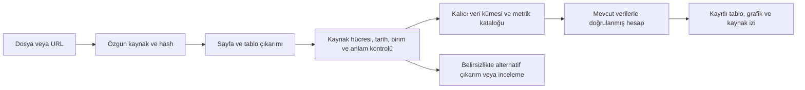

# Mentör sonrası geliştirme ve doğrulama

13 Eylül kullanıcı geri bildirimi, sayısal kabul testleri geçse de sonuç ekranının yeterince okunabilir olmadığını gösterdi. Tek tarihli yanıtın tekrarı, ham araç JSON'u, ara sütunlar ve uygunsuz grafik önerileri ayrıca düzeltildi. Önceki HTTP kontrolleri görsel ürün kabulü sayılmaz. [Sunum düzeltmesi ve gerçek tarayıcı kanıtı](product-presentation-2026-09-13.md) bu ek çalışmayı kaydeder; aşağıdaki eski deney kayıtları değiştirilmemiştir.

Çalışma geçmişi de [anlaşılır aşamalara dönüştürüldü](activity-journey-2026-09-13.md). Model ve araç olaylarının sayısı artık iş adımı gibi gösterilmez; kullanıcı kaynak, veri hazırlığı, hesap, kontrol ve sunum aşamalarını açarak izler. Teknik kayıtlar ayrıca korunur.

Başlangıç kodu `95680ab615175ba917090908b39a420e7b746d4f`. Bu çalışma, yeni bir kaynağın sisteme katılıp doğru kapsamla hesaplanması, grafiğe dönüşmesi ve son cevabın kayıtlı hesapla eşleşmesi üzerine yapılmıştır. Banka adı, beklenen sayı veya belirli bir test sorusu üretim koduna doğru cevap olarak yazılmamıştır. Sayısal kabul doğruları yalnız değerlendirme betiklerinde bulunur.

Kabul dayanağı, kullanıcının paylaştığı mentör dökümündeki T001-T003 (yeni kaynak), T011-T014 (doğruluk), T041-T054 (grafik ve takip soruları), T063-T064 (kaynak) ile yarışma sunumunun s.6-13 bölümleridir. Dökümün konuşmacı atamaları bağımsız ses doğrulaması sayılmaz. Mentörün görüşleri resmî puan ağırlıklarına çevrilmemiştir. [Uygulama planı](../../MENTOR_READINESS_PLAN.md) ve [açık kaynak envanteri](../../OPEN_SOURCE.md) ayrı tutulur.

## Uygulanan değişiklikler

### Kaynaktan analize geçiş

Mevcut sürümlü depolama temeli yeni içe alma akışına bağlandı. Kaynak yalnız sohbet bağlamına eklenmez. Ham dosya, URL ve SHA-256 özeti çalışma alanının `document_sources` dizininde tutulur. Çıkarılmış adaylar yayımlanmadan önce ayrı inceleme kayıtlarında kalır. Doğrulanan veri kümesi dönüşüm CSV'si, türlenmiş Parquet, veri sözleşmesi ve hücre kökenleriyle kalıcı yayımlanır. Depodaki geçici alandan atomik yayın, disk senkronizasyonu, çalışma alanı kilidi, beklenen sürüm kontrolü ve değişmez revizyonlar korunur. Yeni derleyici tamamlanmış yayını kesinti sonrası kendi anahtarından bulur; değişmiş kaynak eski makbuzla tekrar yayımlanamaz. Katalog bu kayıtlı manifestlerden oluşur ve agent yeni metrikleri mevcut veriyle aynı sorgu hizmetinden kullanır.

Bu uygulama ham kaynak, doğrulanmış veri ve kayıtlı analiz katmanlarını Parquet, DuckDB ve sürümlü manifestlerle yerelde gerçekleştirir. Delta/Iceberg tabanlı dağıtık depo veya kurumsal merkezi katalog değildir. Bronze, silver ve gold anlatımı katmanların sorumluluğunu açıklar; bu ürün adlarının kullanıldığı iddiasına dönüşmez.

Ana mimari değişiklik `ingest_source_table` aracıdır. İlk canlı denemeler, modelin aynı anda finansal kalemi seçmesi, parçalı başlıkları çözmesi, tarih eşlemesi ve veri sözleşmesi yazmasının görevi tamamlamayı engellediğini gösterdi. Artık model kaynakta hangi kalemlerin, dönemlerin ve tutar başlığının istendiğini seçer. Sistem bu iş seçimini gerçek kaynak hücrelerinden doğrulanmış yayımlama sözleşmesine dönüştürür. Başarılı sonuç doğrudan çalıştırılabilir analiz isteği içerir. Bu, Akbank veya başka bir şirketin sabit tablosuna yazılmış bir çözüm değildir.

Derleyici birimi ve ölçeği kaynak alıntısından, tarih sahipliğini gerçek başlık hücrelerinden veya açıkça tekrarlanan alt başlık gruplarından doğrular. En yakın tarihi seçme veya ekonomik büyüklükten sayı biçimi tahmin etme kullanılmaz. Sayı biçimi birden fazla yoruma açıksa kaynakta yazılı bir alt toplam eşitliği tek yorumu kanıtlayabilir; aksi durumda belirsizlik bildirilir. Kaynakta dönem sonu aynı olan altı aylık ve üç aylık sütunlar birbirinin yerine geçirilmez. Desteklenmeyen düzen için mevcut ileri düzey araçlar korunur; anlamsal ret bu yoldan aşılamaz.

Tekrarlı Garanti denemesi bir başka sorunu gösterdi: aynı sayfanın çizgilere göre çıkarımı çok sayıda satırı tek hücreye sıkıştırırken, metne göre çıkarımı düzgün satırlar içeriyordu. Agent reddedilen adayı tekrar seçiyordu. İnceleme gerektiren çıkarım artık aynı ham kaynağın aynı sayfasındaki uygun bağımsız alternatifleri ve kaynakta doğrulanmış kalem seçimini döndürür. OCR, insan incelemesi bekleyen veya başka sayfadaki adaylar bu öneriyle otomatik güvenilir sayılmaz. Adaya özgü satır ve sütun adresleri yeni çıkarıma taşınmaz.

Aynı kaynakta istenen kalemin bulunmaması, tutar sütunlarının hizalanmaması veya tarih eşlemesinin kurulamaması da uygun alternatif çıkarım için değerlendirilir. Önerilen iş seçimi, alternatifin gerçek satır ve tarih başlıklarında doğrulanır; yinelenmiş kalemlerin kapsam belirsizliği ortadan kalkmış sayılmaz. Birleşik tarih başlığında ise önce tam tutar/başlık grubunun kaynak eşleşmesi çözülür, sonra kullanıcının sütun seçimi uygulanır. Aynı hücrenin tarihinin tek veya birden fazla sütun seçimine göre değişmemesi sağlanır. Gerçek Tüpraş kaydının hem cari hem önceki dönem sütunları tek başına ve birlikte [kaynak hücreleriyle doğrulanmıştır](structural-recovery-acceptance.json).

Kaynaktaki değeri göstermek, üzerinde hesap yapmaktan ayrıldı. `source_value` çıktı anahtarı başına tam bir özgün kaydı seçer, tarih veya değer değiştirmez ve birden fazla kaydı ilk/son seçimiyle gizlemez. Bir akımın dönem başlangıcı bilinmiyorsa türü ve inceleme durumu korunur; otomatik olarak birikimli veya aylık akım olduğu iddia edilmez. Kaynak tutarları tablo ve grafikte gösterilebilir, ancak uygun olmayan toplama ve değişim işlemleri engellenir.

PDF'nin tamamını model bağlamına sığdırmak yerine `find_source_pages` gerçek belge metninde başlık arar; `inspect_source` seçilen sayfalarda tablo çıkarır. Sayfa numaraları 1 tabanlıdır. İstenen dipnotun ilk 30 sayfanın dışında olması, bütün belgenin reddedilmesine yol açmaz. Görüntüden oluşan sayfalar metin aramasında okunmuş sayılmaz.

Belge boyutu sınırı, gerçek yıllık rapor denemesindeki engel üzerine 16 MiB'den 32 MiB'ye çıkarıldı. İndirme hâlâ süre ve bayt sınırlarıyla çalışır. 19.390.970 baytlık Akbank 2025 yıllık raporu alındı; 335 sayfanın 281'i arama bütçesi içinde işlendi ve devam sayfası 282 olarak açıkça bildirildi. Bu, bütün raporu veya bütün tablolarını okuma kanıtı değildir.

`read_source_table` aday tablonun istenen satırlarını getirir. `prepare_source_table` kaynak satırlarını ve sütunlarını seçer, parçalı açıklama sütunlarını birleştirir ve yatay dönemleri uzun tabloya dönüştürür. Birleşik başlıkta tarih birden fazla hücreye dağılmışsa her tutar sütunu gerçek başlık hücrelerinin adreslerine bağlanır. Bu araçlar modelin verdiği yeni finansal sayıları tabloya yazmaz. `combine_source_tables` uyumlu başlıkları olan ardışık sayfa tablolarını kaynak izlerini koruyarak birleştirir.

Aynı başlık hücreleri birden fazla tarihi içeriyorsa `date_index`, belirtilen biçimle kaynak metninden ayrıştırılan gerçek tarihlerden birini seçer. Kaynağa yeni tarih eklemez; birleşik özgün metin, seçilen sıra ve kaynak hücre adresleri saklanır. Sütun eşlemesinin yönü açıkça tanımlıdır. Ters yazılmış bir eşleme ancak bütün kaynak ve hedef sütunlarını tekil ve eksiksiz eşliyorsa dönüştürülür; kısmi veya çift anlamlı eşlemeler hata olarak kalır.

Birim sözleşmesi para birimi, ölçek, dönem davranışı, fiyat temeli ve kapsamı taşır. Örneğin `TRY_thousand` ölçeği içerir; buna bir kez daha `scale=1000` uygulanması reddedilir. USD sütunu yanındaki TRY sütununun alıntısıyla doğrulanamaz. Satın alma gücü tarihi yazan raporun nominal tutarmış gibi yayımlanması engellenir. Excel formülünün hesaplanmış önbelleği yoksa eksik değer açıkça gösterilir. OCR çıktısı ve ham kaynak hash ile saklanır; doğrulanmamış OCR hücreleri otomatik olarak güvenilir veri statüsüne geçirilmez.

Statik ve olay verileri `aggregate_dataset` üzerinden açık filtre, grup ve ölçü kurallarıyla kayıtlı analize dönüşür. Bu sayede her tabloyu düzenli aylık seri gibi tanımlamak gerekmez. Stokların dönemler boyunca toplamı, sabitlenmemiş kapsamın gerekçesiz birleştirilmesi ve eksik gözlemin sıfır sayılması engellenir. İşleme katılan kaynak satırları ve ağırlıkları sonuçtan izlenebilir.

Yeni PDF'nin tarihli stokları ile mevcut sektör serileri arasındaki bağlantı ayrıca kuruldu. `execute` içindeki açık `period_end`, hazır stok gözlemlerini gerçek tarihleri hedef takvimin tam son gününe uyuyorsa eşler. Kaynağın `event` frekansı değiştirilmez; aylık yayın yaptığı varsayılmaz. Seçilen pencere içinde dönem sonuna uymayan gözlem varsa plan reddedilir. Eksik dönemlerde değer taşıma veya sıfır üretme yapılmaz. Akımlar ve inceleme gerektiren anlamlar bu yöntemle hesap izni kazanmaz. Kapsam ve birim kontrolleri ayrıca uygulanır.

Yayımlama sonucu `available_series` kataloğunu da döndürür. Gerçek yayımlanmış Parquet dosyasından metrik kimliği, tam boyut seçimi, özgün tarihler, tür, birim ve inceleme durumu alınır. Agent'ın boyut adını tahmin etmesi gerekmez. Yalnız kaynak gösterimi için verilen `source_value` tarifi, mevcut kaynaklarla karşılaştırmada zorunlu ara adım değildir. Böyle bir karşılaştırma aynı `execute` planına gider. Katalog önizlemesinin sınırları ve toplam kayıt sayıları açıkça belirtilir.

Ana uygulamada ileri düzey `prepare_source_table` ve `publish_selected_table` araçları başlangıçta modele sunulmaz. Derleyici belirli kaynak ve tablo için açık `unsupported_layout` sonucu verirse o tablonun yedek yolu açılır; normal CSV bu yolu kullanabilir. Açılan yetki başka tabloya veya kaynağa uygulanamaz. Hazırlanmış alt tablo ancak gerçek üst tablo bağlantısıyla aynı yola katılır. İnceleme veya anlam reddi bu yetkiyi vermez. Kontrol, modelin gördüğü araç listesine ek olarak çağrı yürütülmeden önce de uygulanır. Yeni kullanıcı turunda yetkiler sıfırlanır; kesinti sonrası aynı turun kayıtlı sonuçlarıyla devam edilebilir. Doğrudan belge API'sinin ileri düzey kullanımını kaldırmaz.

Kaynak izleri, CSV okuma ve tür dönüşümünden sonraki gerçek sıralamayla birlikte taşınır. Çıktı hücresinin doğru sayıyı göstermesi ile doğru kaynak hücresine bağlanması ayrı ayrı sınanır. Önceki denemelerde bulunan satır sırası sorunu düzeltildi; eski kayıtlar değiştirilmedi. Yeni yayımlamalarla Garanti ve Tüpraş'ın hücre kökenleri bağımsız olarak yeniden doğrulandı. İnsan incelemesinde değiştirilen hücreler de özgün makine hücresi olarak gösterilmez, inceleme kaydına bağlanır.

### Finansal anlam ve hesap

Keşif sıralaması tutar ile adedi, stok ile yeni akımı, toplam ile alt kalemi ayırır. Uzun isteğin başındaki dosya kimliği veya URL, asıl metrik ifadesini arama sınırının dışına itemez. EVDS ve BDDK metrikleri mevcut kataloğun tamamında aranır.

Gerçek denemede BDDK'nın iki ayrı "Toplam Krediler" tablosunun farklı sayılar vermesi araştırıldı. BDDK'nın kendi açıklaması, bazı bülten tablolarının raporlayan banka kapsamından istisnalar içerdiğini bildirir. Bu nedenle kaynak adaptörüne tablo kategorisine bağlı, dayanağı belirtilmiş nüfus ve ölçüm sözleşmeleri eklendi. Bilanço toplamı ile daha dar kapsamlı kredi dökümü sessizce eşdeğer kabul edilmez. Düzenleyici likidite ağırlığı uygulanmış tutarlar da normal bilanço tutarlarıyla aynı ölçü sayılmaz. Bu, bütün kaynaklara uygulanacak bir banka adı tercihi değildir; BDDK kaynağının belgelenmiş tanımıdır. [BDDK açıklaması](https://www.bddk.gov.tr/BultenAylik/tr/Home/Aciklama), [BDDK metaverisi](https://www.bddk.org.tr/BultenDosyalari/Home/Index/Aylik-MetaVeri).

`summarize_analysis`, değişmez analiz tablosundan dönem toplamlarını, değişimleri ve özet istatistikleri hesaplayıp hash ile doğrulanan ayrı bir dosyaya kaydeder. Sayısal son cevap bu dosyadan oluşturulur. Modelin hesapla uyuşmayan serbest sayısal anlatımı doğru tablonun üzerine yazılmaz. Yılbaşından itibaren birikimli değer, ayrı aylık akım, stok ve oran aynı toplama kuralına sokulmaz. Eksik takvim ve eksik uç dönem kontrolleri grup başına yapılır; büyük tamsayıların kayan noktalı sayıya dönüştürülerek yuvarlanması önlenir.

Kaydedilmiş hesap farklı kapsamları açık karşılaştırma amacıyla bölüyorsa, sonuçtan üretilen cevap bu oranın resmi sektör/pazar payı olmadığını belirtir. Bu ifade modelin serbest gerekçesindeki sayılardan kopyalanmaz; hesap kaydındaki kapsam uyarısına dayanır ve grafik değiştirme takibinde de korunur. Ölçek dönüşümünde hedef ölçeğin göreli bölme katsayısı değil, çıktıdaki bir sayının temsil ettiği temel birim sayısı olduğu araç sözleşmesinde açıklanır.

### Görevin bitişi ve takip soruları

`plan_task` istenen tablo, grafik, kaynak, veri kümesi, özet ve istatistik çıktılarını kaydeder. İlk plan çıktı türlerini belirtir. Ayrıntılı özet koşulları, kayıtlı analiz tablosunun gerçek sütunları, ölçü türleri ve dönemleri üzerinden doğrulandıktan sonra eklenir; geçersiz tahminler bağlayıcı koşula dönüşmez. Mevcut geçerli koşulların silinmesi veya zayıflatılması kabul edilmez. Aynı satırdaki banka/sektör oranı, dönemler arası büyüme özetiyle karıştırılmaz. Web araştırmasının bitmesi hesap ve grafik isteyen görevi erkenden bitirmez. Son cevap, soru sorma ve bütçe bitişi yollarında mevcut çıktılar kontrol edilir. Kaydedilmiş kısmi sonuçlar korunur; eksik grafik tamamlanmış sayılmaz.

Kullanıcının açık ortak birim/ölçek şartı `normalization` koşuluyla da kaydedilir. Türkçe ve İngilizce açık ölçek eşitleme istekleri için dar bir kontrol, model bu koşulu plana eklemese de şartın unutulmasını önler; kavram sorusu ve olumsuz istek aynı davranışı başlatmaz. Tamamlama denetimi karşılaştırılan bağımsız tutarların kayıtlı birim, para birimi ve ölçeklerini kontrol eder. Yalnız kayıtlı ölçek dönüşümünden türeyen sütunlar özgün tutarın yerine koşulu sağlayabilir; bir kaynağın iki kopyası iki ayrı tutar sayılmaz, yüzde oranı tutarın yerine geçmez. İki kaynak kesin değilse seçim istenir. Ham değerler korunur; döviz dönüşümü veya kaynağın yeniden yazılması yapılmaz. Eksiklikte gerçek sütunların ölçekleri ve analiz revizyonu için düzeltme bilgisi verilir. Önceki başarılı ve başarısız PDF kayıtları bu kontrolle ayrı ayrı sınanmıştır.

Düzeltilebilir birim gösterimi veya yatay tablo dönüşümü hatasından sonra model erkenden son cevap verirse, mevcut karar bütçesi içinde bir düzeltme fırsatı tanınır. Güvensiz kapsam birleştirmesi veya sonucu bilinmeyen yazma işlemi bu fırsatla geçerli sayılmaz. Büyük belge önizlemeleri model için küçültülür; tam araç kaydı korunur. Kesilmiş geçmiş araç argümanları sağlayıcıya bozuk JSON olarak yeniden gönderilmez.

Yayımlama sonrası bağlamın yaşam döngüsü ayrıca düzenlendi. Gerçek PDF-sektör denemesinde bütün hesap ve grafikler doğru olmasına rağmen son karar öncesinde bağlam sınırı aşılmıştı. Kaynak yayımlandıktan ve bağlam baskısı oluştuktan sonra, yalnız eski başarılı kaynak gezinmesi kısa kayıtlara dönüşür. Kaynak hash'i, sayfa/tablo/satır adresleri, inceleme uyarıları ve yeniden okuma isteği korunur. Başarısız araçların toparlanma bilgileri, yayımlanmamış kaynaklar ve yayımlama sonrası yeniden okumalar kısaltılmaz. Kayıtlı veri sözleşmesi, metrik kataloğu, aktif analiz, grafik, hücre kanıtları ve kullanıcı isteği korunur. Ham günlük değiştirilmez; bütçe sınırına takılmak başarı sayılmaz.

Son test paketindeki 26 bin karakterlik senaryo, ilk katalog adaylarının sabit bağlamda ayrıntılı biçimde tekrar kaldığını gösterdi. Yalnız mevcut bütün küçültmelerden sonra bütçe hâlâ aşılıyorsa, bu ilk adaylar da mevcut kısa keşif görünümüne geçirilir. Önceden bütçeye sığan isteğin içeriği değişmez; aktif şema ve ham kayıtlar korunur. Son üç gerçek PDF denemesinin kayıtlarından yeniden oluşturulan bağlamlar değişiklik öncesi ve sonrasında [aynı hash'i üretmiştir](context-initial-card-equivalence.json). Bu çevrimdışı eşdeğerlik kontrolü ek bir canlı model tekrarı sayılmaz.

Gruplu analizlerde çizgi, çubuk ve alan grafikleri her grubu ayrı seri olarak gösterir. Eksik satır ile kaynakta null bulunan satır ayrı kalır. Grafik türü değiştirmek kaynak tablosunu değiştirmez. `revise_analysis` grup başına dönüşüm ekleyebilir; eski satırları, kaynak sütunlarını ve sıralamayı korur. Haftalık ve yıllık takvim adları istatistik araçlarında ortaklaştırıldı; düzensiz veri düzenliymiş gibi test edilmez.

Son canlı kontrolde aynı banka karşılaştırmasının iki farklı tablo düzeniyle üretildiği görüldü: bir denemede gruplar satırlarda, diğerinde dokuz ayrı sütundaydı. İkinci durumda eski altı sütun sınırı üç bankayı grafik dışında bırakıyordu. Geniş tablolarda seçili bütün seriler 30 sütuna kadar korunacak şekilde düzeltildi; daha büyük seçimler sessizce kırpılmaz. Aynı metrik başlığını taşıyan seriler kaynak boyutlarındaki banka adlarıyla ayrılır. Bu kimlikler hücreyi bulmak için gereken satır boyutlarından ayrı tutulur; kaynak açıklaması yolu korunur.

Kapasite hatasıyla reddedilmiş, kayıtlı gerçek sütunlardan oluşan açık bir grafik seçimi, aynı kullanıcı turunda sessizce küçültülerek tamamlanmış sayılamaz. Eksik sütunlar belirtilir; mevcut bütçe içinde düzeltme veya kısmi sonuç gerekir. Yeni kullanıcı turunda daha dar seçim yapılabilir. Bu kontrol bütün doğal dil niyetlerini çözmüş sayılmaz; gözlenen kapasite hatasının serileri gizlemesini engeller.

### Web ve açık kaynak

Web araştırması arama sonucundan resmî arşive ve asıl belgeye sınırlı sayıda adımla ilerler. Tarih, konu, makale bağlantıları ve indirme bağlantıları gezinmede dikkate alınır. Resmî takvim sayfasının bulunması, takvimdeki karar metninin okunmasıyla eşdeğer sayılmaz. Kaynak bağlantıları modelin sonraki araç çağrısında kullanabileceği biçimde korunur.

Veri, ayrıştırma, hesap ve grafik bileşenleri mevcut açık kaynak bağımlılıklarla yerelde çalışır. Yeni zorunlu paket eklenmedi. İsteğe bağlı SearXNG entegrasyonu yerel veya konteyner içindeki operatör adresini destekler; gerçek bir yerel HTTP sunucusuyla protokol testi yapıldı. Çalışan tam bir SearXNG kurulumunun arama kalitesi ölçülmedi. Varsayılan Bing RSS dış arama hizmetidir; yerel yazılımın açık kaynak olması dış hizmetin kaynak kodunu açık yapmaz. Yarışmanın Kloudeks model kullanım koşulu korunur.

## Gerçek kaynak doğrulamaları

Araç düzeyindeki bu sonuçlar, modelin aynı işi her doğal dil sorusunda otonom tamamlayacağı iddiası değildir. Tam canlı görevler ayrıca değerlendirilir.

| Kaynak | Bağımsız kontrol | Sonuç ve sınır |
| --- | --- | --- |
| BDDK aylık kâr | 2025 ilk altı ay 422.459, 2026 ilk altı ay 528.431 milyon TL; fark 105.972; artış %25,084564 | Ham kaynak ve ayrı aylık akımlar aynı toplamı doğrular. |
| BDDK banka grupları | 10 grup x 3 ay, 30 kaynak hücresi | Çizgi, çubuk, alan ve ısı haritasında aynı değerler. Gerçek arayüzün grafik kodu ve ECharts ile SVG üretildi. Tarayıcı etkileşim testi iddiası yok. |
| EVDS haftalık seri | 26 gözlemli kayıtlı haftalık seri | Cuma takvimi ile istatistik çalıştı; düzensiz gözlem desteğine genellenmez. |
| [Garanti 2026 ilk çeyrek](https://www.garantibbvainvestorrelations.com/en/images/pdf/31_March_2026_Consolidated_Financial_Report.pdf), PDF s.11 | Finansal varlıklar: 1.279.933.463 / 1.260.568.409; nakit: 867.799.356 / 1.005.229.845 bin TL, 31 Mart 2026 / 31 Aralık 2025 | 141 sayfalık belgeden toplam sütunları, birleşik tarih başlıkları, yayımlama, kayıtlı analiz ve grafik doğrulandı. |
| Yeni Garanti PDF'si + mevcut BDDK sektörü | 31 Mart 2026 toplam aktifler: 4.783.750.292 bin TL; sektör: 49.735.194 milyon TL; ölçek eşitlemesi sonrası oran %9,618441 | Gerçek kaynakla içe alma, ortak hesap, iki grafik ve hücre açıklaması [26 kabul kontrolünü geçti](pdf-sector-acceptance.json). Konsolide grup ve sektör kapsamı eşdeğer değildir; resmi pazar payı olarak yorumlanmaz. Bu satır araç düzeyi kanıtıdır. |
| [Tüpraş 2025 ara dönem](https://www.tupras.com.tr/assets/uploads/financial-reports/tupras-consolited-cmb-30062025.pdf), PDF s.3 | Nakit 90.351.730; toplam varlıklar 545.630.257 bin TL | Banka dışı belge, statik tablo, 30 Haziran 2025 satın alma gücü temeli, kayıtlı analiz ve grafik doğrulandı. |
| [Akbank 2026 ara dönem](https://www.akbankinvestorrelations.com/en/images/pdf/consalidated/akbank_en_consolidated_2q26.pdf), PDF s.10 | Dönem kârı 2025 için 24.850, 2026 için 34.333 milyon TL | Altı aylık kapsam korundu; ayrı aylık kâr olduğu varsayılmadı. |
| İşbank 2026 sunumu | İştirak varlık ve özkaynak sütunları | Kaynakta USD bin ölçeği, iki ayrı ölçü ve kaynak hücreleri doğrulandı. |
| [TCMB 6 Mart 2025 kararı](https://www.tcmb.gov.tr/wps/wcm/connect/en/tcmb%2Ben/main%2Bmenu/announcements/press%2Breleases/2025/ano2025-15) | Politika faizi %45'ten %42,5'e | Doğru karar tarihi ve karar metni gereklidir; faiz geçmişi veya takvim tek başına kabul edilmez. |

Ham raporlar, tam araç günlükleri, çalışma alanları ve eski başarısız denemeler yerel [kanıt klasöründe](</Users/edurmus/Downloads/kkb-hackathon-2026-notlar/mentor-improvements-2026-09-12>) korunur. Büyük çalışma veritabanları repoya eklenmez. Her denemenin kod ve veri hash'i kaydedilir. Ana finans veritabanı değiştirilmez.

Araçların gerçek veride doğru çalışması ile modelin görevi tamamlaması ayrı ölçülür. İlk birleşik PDF-sektör canlı denemesinde bir tekrar doğru oranı kaydetmiş, fakat ortak birim ve grafik koşullarını tamamlamamıştır. Diğer tekrar ileri düzey tablo hazırlama yoluna sapıp karar bütçesini tüketmiştir. Bu [başarısız canlı kayıt](pdf-sector-live-before-workflow-gate.json) saklanır; araç düzeyindeki başarıyla örtülmez. Bu gözlem, ana içe alma yolu ile ileri düzey yedek yolun yalnız prompt üzerinden ayrılmasının yeterli olmadığını göstermiştir.

## Canlı görevlerin kabul kaydı

[Kanıt dizini](acceptance-index.json), her senaryoyu kendi kapanmış çalışma turuna, kod ve veri hash'lerine, bağımsız değerlendiricisine ve gerçek çıktı dosyalarına bağlar. Aşağıdaki satırlar farklı aşamalardaki son değerlendirmelerdir; tek bir kod sürümünde ölçülmüş ortak başarı yüzdesi değildir. Uygulamanın `completed` demesi yeterli sayılmaz: kayıtlı sayılar, kaynak hücreleri, istenen grafik ve finansal kapsam ayrıca kontrol edilir.

| Canlı görev | Kabul edilen tekrar/tur | Kayıt |
| --- | --- | --- |
| BDDK altı aylık kâr karşılaştırması | 2/2 | `live-final` |
| TCMB kararını webden araştırma | 2/2 | `live-final` |
| Yeni CSV ile mevcut BDDK kredilerinin karşılaştırılması | 2/2 | `live-workflow-final` |
| Garanti PDF'sinden iki dönem ve iki kalem | 2/2 | `live-period-end-final` |
| Banka dışı Tüpraş PDF'sinden tablo ve grafik | 2/2 | `live-verification-final` |
| Banka grupları, fark hesabı, grafik değiştirme | İki konuşmada toplam 6/6 tur | `live-chart-final`, ayrı grup değerlendiricisi |
| Yeni PDF ile mevcut sektör aktiflerini karşılaştırma | 3/3 | `live-normalization-final`, [ayrıntılı kayıt](normalization-live-acceptance.json) |

Önceki `live-verification-final` turunda aynı senaryonun iki görevi uygulamada tamamlandı olarak görünmüştür. Bağımsız kontrol, ikinci tekrardaki doğru oran ve kaynaklara rağmen bin TL ile milyon TL tutarlarının ortak ölçeğe dönüştürülmediğini yakalamıştır. Bu [başarısız kayıt](verification-live-acceptance.json) korunur. Açık ölçek şartının görev bitişinde doğrulanması eklendikten sonra üç yeni çalışma alanındaki tekrarların tamamı geçti. Karar sınırı 18, model bağlam sınırı 150 bin karakter olarak kaldı; üç tekrar 10, 13 ve 16 kararda tamamlandı.

## Çalışan uygulama ve doğrulama

Güncel uygulama [yerel önizlemede](http://127.0.0.1:8871/?workspace=workspace_8aac09f293a843bf82681102bf5f8c3b) çalışır. Son başarılı turun çalışma verileri ayrı bir dizine kopyalanmıştır; özgün kabul kayıtları değişmez. Üç çalışma alanı için toplam [41 HTTP kontrolü](preview-verification.json), kayıtlı analizleri, grafikleri, CSV indirmelerini, hücre açıklamalarını, özgün PDF hash'lerini ve sayfanın statik dosyalarını doğrular. Bu kontrol tarayıcı etkileşim testi değildir. Model ve finans verisi uygulamada yapılandırılmıştır.

Tam test paketinin sürüm ve komut bilgileri [test kaydında](test-verification.json), çıktı günlüğü [ayrı dosyada](test-results.txt) tutulur. Önceki başarılı ve başarısız çalışmalar kanıt klasöründe korunur. Uygulama kaynakları ile değerlendirme doğruları ayrıdır; sabit beklenen finansal sayılar değerlendirme betiklerinde bulunur.

## Kabul sınırları

Desteklenen kaynaklar CSV, XLSX, HTML, PDF, UTF-8 TXT ve PNG/JPEG'dir. TXT okuma, serbest metindeki bütün sayıların doğrulanmış finansal olgulara dönüştüğü anlamına gelmez. DOCX, eski XLS ve genel JSON/XML tablo içe aktarımı bu çalışmada eklenmemiştir. Depolama tek sunucudaki POSIX dosya sistemine dayanır; dağıtık yazma, yüksek erişilebilirlik, otomatik değişiklik yakalama ve kurumsal rol/onay zinciri doğrulanmış değildir. [Soğuk yedekleme yöntemi](../../DOCKER.md) belgelenmiştir.

Bu çalışma her PDF veya her web sitesini eksiksiz okumayı kanıtlamaz. OCR hücreleri inceleme gerektirir; düşük güvenli veya düzensiz hücreler tahmin edilerek yayımlanmaz. Şişecam'ın seçilen rapor URL'si uygulamaya HTTP 403 döndürdü ve başarı sayılmadı. Büyük dosya, okunamayan sayfa, parola ve kaynak erişim sınırları kullanıcıya açıklanmalıdır.

Doğru kaynak değerlerini hesaplamak, sorudaki finansal kavramın kesin doğru seçildiğini tek başına kanıtlamaz. Kaynaklar arası konsolidasyon, müşteri nüfusu, brüt/net tutar, dönem ve fiyat temeli eşleşmesi hâlâ görünür kabul ölçütüdür. Gözlenen değişim ekonomik nedeni kanıtlamaz; Granger ve korelasyon sonuçları nedensel etki iddiasına dönüştürülmez.

Test ve tekrar sonuçları yalnız sabit sorular, kaydedilen kaynak sürümleri ve ilgili kod sürümü için geçerlidir. Yarışmada birincilik veya genel doğruluk yüzdesi bu küçük kabul kümesinden çıkarılmaz.
